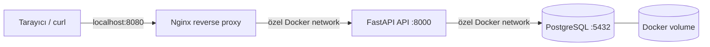

# terraform-docker-infrastructure-lab

Terraform ve Docker kullanarak yerel ortamda çalışan, üç katmanlı bir uygulama altyapısı eğitim projesi. Amaç; Terraform’un provider, resource, variable, output, dependency, state ve yeniden kullanılabilir yapılandırma yaklaşımını küçük ama gerçekçi bir örnek üzerinde göstermektir.

> Bu proje eğitim ve portföy amaçlıdır. Production ortamı için secret yönetimi, TLS, yedekleme, izleme ve daha güçlü ağ politikaları ayrıca tasarlanmalıdır.

## Mimari



Dışarıya yalnızca Nginx portu açılır. FastAPI ve PostgreSQL host portlarına publish edilmez; servisler özel Docker network üzerinde container adıyla haberleşir. PostgreSQL verisi `${environment}` bazlı kalıcı Docker volume içinde tutulur.

## Kullanılan teknolojiler

- Terraform 1.5+ ve `kreuzwerker/docker` provider 3.x
- Docker Engine / Docker Desktop
- Nginx 1.27 Alpine
- Python 3.12, FastAPI, Uvicorn ve psycopg 3
- PostgreSQL 16 Alpine
- GitHub Actions

## Ön koşullar

Docker Desktop veya Docker Engine çalışıyor olmalı. Ayrıca Terraform 1.5+ ve Python 3.12+ kurulu olmalıdır. `make test` için Python sanal ortamında test bağımlılıkları bulunmalıdır.

## Hızlı başlangıç

```bash
cp terraform.tfvars.example terraform.tfvars
# terraform.tfvars içindeki örnek parolayı yalnızca lokal kullanım için değiştirin.

make init
make fmt
make validate
make plan
make apply
```

Başarılı apply sonrasında:

```bash
curl http://localhost:8080/
curl http://localhost:8080/health
curl http://localhost:8080/db-health
```

Terraform çıktısındaki `application_url` değerini de kullanabilirsiniz.

## Development ve production örnekleri

Örnek dosyalar gerçek secret içermez; kendi lokal dosyanızı oluşturun:

```bash
cp environments/development.tfvars.example terraform.tfvars
make plan
make apply
```

Production isimlendirmesini ve portunu lokal olarak denemek için:

```bash
cp environments/production.tfvars.example terraform-production.tfvars
# terraform-production.tfvars içindeki parolayı değiştirin.
terraform plan -var-file=terraform-production.tfvars
terraform apply -var-file=terraform-production.tfvars
```

`*.tfvars` dosyaları `.gitignore` içindedir. Gerçek parola veya secret commit edilmemelidir. CI yalnızca format/init/validation ve Python kontrollerini çalıştırır; Docker erişimi gerektiren `terraform apply` otomatik çalıştırılmaz.

## Make komutları

| Komut | Açıklama |
|---|---|
| `make init` | Provider bağımlılıklarını indirir ve Terraform’u başlatır. |
| `make fmt` | Terraform dosyalarını formatlar. |
| `make validate` | Terraform yapılandırmasını doğrular. |
| `make plan` | `terraform.tfvars` ile değişiklik planını gösterir. |
| `make apply` | Lokal Docker altyapısını oluşturur veya günceller. |
| `make destroy` | Container, network ve volume kaynaklarını kaldırır. |
| `make test` | FastAPI testlerini ve Ruff lint kontrolünü çalıştırır. |

Başka bir değişken dosyası için: `make plan TFVARS=environments/development.tfvars`.

## Endpoint örnekleri

| Endpoint | Amaç |
|---|---|
| `GET /` | Uygulama adı, ortam ve çalışma bilgisini döndürür. |
| `GET /health` | FastAPI prosesinin hazır olduğunu gösterir. |
| `GET /db-health` | PostgreSQL’e gerçek bir `SELECT 1` bağlantı kontrolü yapar. |

## Proje dizin yapısı

```text
.
├── .github/workflows/ci.yml
├── app/
│   ├── Dockerfile
│   ├── main.py
│   ├── requirements.txt
│   ├── requirements-dev.txt
│   └── test_main.py
├── environments/
│   ├── development.tfvars.example
│   └── production.tfvars.example
├── nginx/nginx.conf
├── main.tf
├── providers.tf
├── variables.tf
├── outputs.tf
├── Makefile
└── terraform.tfvars.example
```

Bu örnekte kaynaklar tek bir kök modülde tutuldu. Üç servisin tanımları birbirinden farklı olduğu için yapay bir modül katmanı eklenmedi; daha büyük projelerde tekrar eden container veya network desenleri `modules/` altına taşınabilir.

## Terraform state

Local backend varsayılan olarak kullanılır ve state dosyası çalışma dizininde oluşur. State, oluşturulan Docker kaynaklarının gerçek durumunu takip etmek için gereklidir; ancak secret değerleri içerebileceğinden `*.tfstate*` `.gitignore` içindedir ve repository’ye gönderilmemelidir. Ekip çalışmasında şifreli, erişim kontrollü uzak backend tercih edilmelidir.

## Güvenlik notları

- PostgreSQL host portuna publish edilmez.
- Secret değişkeni `sensitive = true` olarak tanımlıdır.
- Gerçek secret’lar `.tfvars` veya state içine yazılmamalı; eğitimde bile lokal, geçici değerler kullanılmalıdır.
- Nginx burada HTTP ile çalışır. Gerçek kullanımda TLS ve secret manager eklenmelidir.
- Container image tag’leri örnek olarak sabitlenmiştir; güncelleme yapılırken güvenlik taraması ve kontrollü yükseltme uygulanmalıdır.

## Sorun giderme

**`Cannot connect to the Docker daemon`**: Docker Desktop/Engine’i başlatın ve `docker info` komutunu kontrol edin.

**Port zaten kullanılıyor**: `terraform.tfvars` içindeki `nginx_port` değerini boş bir host portuyla değiştirin.

**`db-health` başarısız**: `docker ps` ve `docker logs terraform-docker-lab-development-postgres` ile PostgreSQL’in health durumunu ve loglarını kontrol edin. İlk başlatmada veritabanının hazır olması birkaç saniye sürebilir.

**Nginx 502 döndürüyor**: API container loglarını (`docker logs terraform-docker-lab-development-api`) ve `docker network inspect` çıktısını kontrol edin; gerekirse `terraform apply` sonrasında birkaç saniye bekleyin.

**Provider veya Terraform sürüm hatası**: Terraform sürümünün `>= 1.5.0, < 2.0.0` aralığında olduğundan emin olun ve `make init` komutunu yeniden çalıştırın.

## Temizleme

```bash
make destroy
```

Bu komut Terraform’un yönettiği container, network ve PostgreSQL volume’unu kaldırır; PostgreSQL verisi de volume ile birlikte silinir. Sadece container’ları kaldırmak yerine state ile uyumlu temizlik için Terraform kullanın.

## Bu projede öğrenilen kavramlar

- Docker provider ile image, container, network ve volume resource yönetimi
- Terraform variable tipleri, açıklamaları, validation ve sensitive değerler
- Resource dependency graph ve servis başlatma sırası
- Container healthcheck ile proses ve veritabanı hazır olma kontrolü
- Docker network üzerinden servis keşfi ve reverse proxy
- Local Terraform state, plan/apply/destroy döngüsü ve outputs
- Sabitlenmiş Python bağımlılıkları, Dockerfile ve temel API testleri
- Docker gerektirmeyen Terraform CI doğrulaması ve güvenli GitHub Actions tasarımı
