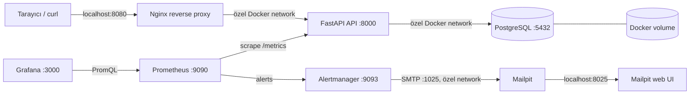

# terraform-docker-infrastructure-lab

Terraform ve Docker kullanarak yerel ortamda çalışan, üç katmanlı bir uygulama altyapısı eğitim projesi. Amaç; Terraform’un provider, resource, variable, output, dependency, state ve yeniden kullanılabilir yapılandırma yaklaşımını küçük ama gerçekçi bir örnek üzerinde göstermektir.

> Bu proje eğitim ve portföy amaçlıdır. Production ortamı için secret yönetimi, TLS, yedekleme, izleme ve daha güçlü ağ politikaları ayrıca tasarlanmalıdır.

## Mimari



Dışarıdan uygulamaya yalnızca Nginx üzerinden erişilir; FastAPI ve PostgreSQL host portlarına publish edilmez. Prometheus, Grafana, Alertmanager ve Mailpit web arayüzü eğitim gözlemlenebilirliği için ayrı host portlarından açılır. Mailpit’in SMTP portu host’a publish edilmez; yalnızca özel Docker network içinde `mailpit:1025` olarak kullanılır. Servisler özel Docker network üzerinde container adıyla haberleşir. PostgreSQL verisi `${environment}` bazlı kalıcı Docker volume içinde tutulur.

## Kullanılan teknolojiler

- Terraform 1.5+ ve `kreuzwerker/docker` provider 3.x
- Docker Engine / Docker Desktop
- Nginx 1.27 Alpine
- Python 3.12, FastAPI, Uvicorn ve psycopg 3
- Prometheus client, Prometheus ve Grafana
- PostgreSQL 16 Alpine
- GitHub Actions

## Ön koşullar

Docker Desktop veya Docker Engine çalışıyor olmalı. Ayrıca Terraform 1.5+ ve Python 3.12+ kurulu olmalıdır. `make test` için Python sanal ortamında test bağımlılıkları bulunmalıdır. Yük ve uçtan uca alarm testleri için `curl`, `jq` ve çalışan Terraform stack’i gerekir; k6 ayrıca kurulmaz, Docker ile sabitlenmiş resmi `grafana/k6` image’ı kullanılır.

## Hızlı başlangıç

```bash
cp terraform.tfvars.example terraform.tfvars
# terraform.tfvars içindeki örnek parolayı yalnızca lokal kullanım için değiştirin.

make init
make fmt
make validate
make plan
make apply
```

Başarılı apply sonrasında:

```bash
curl http://localhost:8080/
curl http://localhost:8080/health
curl http://localhost:8080/db-health
curl http://localhost:8080/metrics
```

Terraform çıktısındaki `application_url`, `prometheus_url`, `grafana_url`, `alertmanager_url` ve `mailpit_url` değerlerini de kullanabilirsiniz. Grafana’ya `admin` kullanıcı adı ve kendi `grafana_admin_password` değerinizle giriş yapın.

## Development ve production örnekleri

Örnek dosyalar gerçek secret içermez; kendi lokal dosyanızı oluşturun:

```bash
cp environments/development.tfvars.example terraform.tfvars
make plan
make apply
```

Production isimlendirmesini ve portunu lokal olarak denemek için:

```bash
cp environments/production.tfvars.example terraform-production.tfvars
# terraform-production.tfvars içindeki parolayı değiştirin.
terraform plan -var-file=terraform-production.tfvars
terraform apply -var-file=terraform-production.tfvars
```

`*.tfvars` dosyaları `.gitignore` içindedir. Gerçek parola veya secret commit edilmemelidir. CI yalnızca format/init/validation ve Python kontrollerini çalıştırır; Docker erişimi gerektiren `terraform apply` otomatik çalıştırılmaz.

### FastAPI image rebuild davranışı

`docker_image.app` kaynağı, `app/` build context’indeki dosya yollarını sıralayıp her dosyanın içeriğiyle birlikte SHA-256 hash’ler. Bu birleşik değer Terraform Docker provider’ın `triggers.source_hash` alanına verilir. `main.py`, `Dockerfile`, `requirements.txt` veya `app/` altındaki başka bir kaynak değiştiğinde sonraki `terraform plan` image’ın yeniden oluşturulmasını gösterir.

Python cache ve test/lint cache dosyaları (`__pycache__`, `.pytest_cache`, `.ruff_cache`, `.pyc`) hash’e dahil edilmez; bunlar Docker build context’inden de `.dockerignore` ile çıkarılır. Böylece yalnızca gerçek uygulama girdilerindeki değişiklikler rebuild tetikler.

## Make komutları

| Komut | Açıklama |
|---|---|
| `make init` | Provider bağımlılıklarını indirir ve Terraform’u başlatır. |
| `make fmt` | Terraform dosyalarını formatlar. |
| `make validate` | Terraform yapılandırmasını doğrular. |
| `make plan` | `terraform.tfvars` ile değişiklik planını gösterir. |
| `make apply` | Lokal Docker altyapısını oluşturur veya günceller. |
| `make destroy` | Container, network ve volume kaynaklarını kaldırır. |
| `make test` | FastAPI testlerini ve Ruff lint kontrolünü çalıştırır. |
| `make terraform-test` | Docker oluşturmadan native Terraform testlerini çalıştırır. |
| `make load-smoke` | `/`, `/health` ve `/db-health` için kısa k6 smoke testi çalıştırır. |
| `make load-test` | Kademeli VU artışı ve p95/hata oranı eşikleriyle kontrollü yük testi çalıştırır. |
| `make alert-test-error` | Opt-in kontrollü 500 trafiğiyle `HighErrorRate` alarmını doğrular. |
| `make alert-test-latency` | Opt-in kontrollü gecikmeyle `HighP95Latency` alarmını doğrular. |
| `make alert-test-down` | API container’ını trap ile geri getirerek `FastAPIDown` alarmını doğrular. |
| `make alert-test` | Error, latency ve down alarm testlerini sırasıyla çalıştırır. |

Başka bir değişken dosyası için: `make plan TFVARS=environments/development.tfvars`.

## Endpoint örnekleri

| Endpoint | Amaç |
|---|---|
| `GET /` | Uygulama adı, ortam ve çalışma bilgisini döndürür. |
| `GET /health` | FastAPI prosesinin hazır olduğunu gösterir. |
| `GET /db-health` | PostgreSQL’e gerçek bir `SELECT 1` bağlantı kontrolü yapar. |
| `GET /metrics` | Prometheus’un scrape ettiği istek sayısı ve gecikme metriklerini döndürür. |

`GET /_test/error` ve `GET /_test/latency?delay_ms=750` yalnızca `enable_test_endpoints = true` ile açılan, k6 alarm testlerine özel endpoint’lerdir. Gecikme değeri 50–2000 ms arasında doğrulanır; endpoint’ler varsayılan ve production örneklerinde kapalıdır. Secret, debug bilgisi veya stack trace döndürmezler.

### k6 yük ve uçtan uca alarm testleri

Smoke ve normal yük testleri uygulamanın başarı oranını ve p95 gecikmesini ölçer. Alarm testleri ise bilerek kontrollü 500, gecikme veya API durması üretir; bu nedenle varsayılan `make check` içine eklenmez.

Önce yalnızca lokal test ortamında endpoint’leri açıp yeniden apply edin:

```hcl
enable_test_endpoints = true
```

Ardından örnek komutlar:

```bash
make load-smoke
K6_LOAD_PEAK_VUS=20 K6_LOAD_STEADY_SECONDS=60 make load-test
make alert-test-error
K6_DELAY_MS=900 make alert-test-latency
make alert-test-down
make alert-test
```

`K6_BASE_URL`, `K6_VUS`, `K6_DURATION`, `K6_P95_LIMIT_MS`, `K6_LOAD_PEAK_VUS`, `K6_LOAD_RAMP_SECONDS`, `K6_LOAD_STEADY_SECONDS`, `K6_ERROR_VUS`, `K6_LATENCY_VUS` ve `K6_DELAY_MS` ile hedef, kullanıcı sayısı, süre ve eşikler değiştirilebilir. Container içi varsayılan hedef mevcut Nginx alias’ıdır; host networking varsayılmaz. `ENVIRONMENT`, `CONTAINER_NAME_PREFIX` ve `NETWORK_NAME` ile mevcut Terraform adlandırması seçilebilir.

`scripts/test-alerts.sh` gerekli araçları, Docker network’ünü ve servis health durumlarını kontrol eder. Prometheus HTTP API’de alarmı **Pending → Firing**, Alertmanager API’de teslim edilmiş ve Mailpit API’de ilgili e-posta olarak doğrular. Prometheus ve Alertmanager’daki mevcut `for`/group süreleri değiştirilmez; script süre sınırı olan polling kullanır. FastAPIDown testinde API trap ile yeniden başlatılır ve test sonunda tüm servislerin health durumu yeniden kontrol edilir.

Sonuçları Prometheus’un `/alerts`, Alertmanager’ın `/api/v2/alerts` ve Mailpit’in `/api/v1/messages` endpoint’lerinden veya sırasıyla 9090, 9093 ve 8025 portlarından görebilirsiniz. Alarm firing olduktan sonra trafik kesilince Prometheus resolved durumuna geçer; Alertmanager ve Mailpit `send_resolved` yapılandırmasıyla resolved bildirimi üretir.

Bu uzun süreli ve gerçek Docker altyapısına dokunan alarm testleri otomatik push/PR CI kapısına eklenmemiştir. Paylaşılan state, port ve Docker daemon gerektirdiğinden güvenli bir izolasyon/ephemeral Terraform apply ortamı olmadan manuel workflow eklemek mevcut altyapıyı riske atardı; lokal komutlar kontrollü doğrulama için kullanılmalıdır.

### Verified load and alert test results

10 Ağustos 2026 tarihinde macOS 26.5.2, arm64 ve Docker Desktop üzerindeki Docker Engine 28.3.0 ile lokal `development` ortamında tek bir doğrulama çalışması yapıldı. Host Terraform CLI 1.15.8 bildirdi; gerçek plan/apply ve native testler mevcut CI uyumluluğu için Terraform 1.9.8 container’ında çalıştırıldı. Sonuçlar evrensel performans benchmark’ı değildir; yalnızca bu lokal geliştirme makinesindeki gözlemlerdir.

| Test | Result | Requests | Error rate | p95 | Peak VU / süre | Alert lifecycle | Notification |
|---|---|---:|---:|---:|---|---|---|
| Smoke | Passed | 6,948 | 0.00% | 5.62 ms | 1 / 15 s | N/A | N/A |
| Load | Passed | 107,525 | 0.00% | 6.85 ms | 10 / 60 s | N/A | N/A |
| HighErrorRate | Passed | 135,905 | 100.00% kontrollü 500 | 3.82 ms | 5 / 75 s | Pending → Firing → Resolved | Alertmanager + Mailpit doğrulandı |
| HighP95Latency | Passed | 495 | 0.00% | 762.71 ms | 5 / 75.1 s | Pending → Firing → Resolved | Alertmanager + Mailpit doğrulandı |
| FastAPIDown | Passed | 353,774 | 100.00% beklenen down trafiği | 0.17 ms | 1 / 45 s | Pending → Firing → Resolved | Alertmanager + Mailpit doğrulandı |

Smoke ve load testlerinde k6 threshold’ları geçti. HighErrorRate senaryosu isteklerin tamamında kontrollü HTTP 500 üretti; HighP95Latency senaryosu `delay_ms=750` ile gerçek p95’i 500 ms alarm eşiğinin üzerine çıkardı. FastAPIDown sırasında yalnızca API container’ı geçici olarak durduruldu; script’in cleanup/trap mekanizması API’yi yeniden başlattı ve `/health` tekrar HTTP 200 döndü.

Bu çalışmada `enable_test_endpoints=true` yalnızca açma planı ve alarm testleri süresince kullanıldı. Kapanış planı uygulanınca `/_test/error` ve `/_test/latency` tekrar HTTP 404 döndürdü. PostgreSQL container’ı ve `terraform-docker-lab-development-postgres-data` volume’u korunarak aynı isim ve mount noktasıyla kaldı; network, Prometheus, Grafana, Alertmanager ve Mailpit kaynakları değiştirilmedi.

Test sonrasında değişkensiz gerçek Terraform planı `No changes` verdi ve tüm container’lar healthy kaldı. Aynı doğrulamayı yeniden çalıştırmak için `make load-smoke`, `make load-test`, `make alert-test-error`, `make alert-test-latency` ve `make alert-test-down` komutlarını kullanın. Alarm testleri mevcut Prometheus `for` sürelerini beklediği için birkaç dakika sürebilir.

## Prometheus ve Grafana

FastAPI, her isteği aşağıdaki iki metrikle ölçer:

- `fastapi_http_requests_total`: method, path ve HTTP status etiketleriyle toplam istek sayısı
- `fastapi_http_request_duration_seconds`: method ve path etiketleriyle istek süresi histogramı

Prometheus bu endpoint’i 15 saniyede bir scrape eder. Grafana datasource’u ve `FastAPI Overview` dashboard’u Terraform apply sırasında dosya provisioning ile otomatik yüklenir.

- Prometheus: `http://localhost:9090`
- Grafana: `http://localhost:3000`
- Alertmanager: `http://localhost:9093`
- Mailpit: `http://localhost:8025`
- Grafana kullanıcı adı: `admin`
- Grafana parolası: lokal `terraform.tfvars` içindeki `grafana_admin_password`

Dashboard’da istek hızı, P95 gecikme ve HTTP status dağılımı panelleri bulunur. Prometheus ve Grafana container’ları API ile aynı özel network üzerindedir; Grafana datasource URL’si `http://prometheus:9090` olarak tanımlıdır.

## Lokal alarm yönetimi

Prometheus aşağıdaki kuralları `/etc/prometheus/rules/fastapi-alerts.yml` dosyasından yükler:

- `FastAPIDown`: `up{job="fastapi"} == 0`, 30 saniye pending kaldıktan sonra firing olur.
- `HighErrorRate`: Son 2 dakikadaki FastAPI 5xx oranı toplam isteklerin yüzde 5’ini aşarsa 1 dakika sonra firing olur. Toplam istek yoksa veya veri yoksa alarm üretmez.
- `HighP95Latency`: `histogram_quantile(0.95, sum by (le) (..._bucket))` ile hesaplanan P95 gecikme 500 ms’yi aşarsa 1 dakika sonra firing olur. Histogram verisi yoksa alarm üretmez.

Alertmanager, alarm gruplarını 10 saniye bekleyip toplar, 30 saniyede bir grup aralığı uygular ve 2 dakikada bir tekrar bildirir. Receiver gerçek bir SMTP servisine bağlanmaz; TLS ve kimlik doğrulama olmadan `mailpit:1025` adresine gönderir. Alıcı adresi örnek bir `.local` adresidir ve harici e-posta göndermez.

Prometheus, Alertmanager ve Grafana yapılandırmalarındaki dosya yolları ve içerikleri deterministik SHA-256 hash ile izlenir. Hash değiştiğinde `terraform_data` ve `replace_triggered_by` ilişkisi ilgili container’ı yeniden oluşturur; config dosyaları container’lara read-only bind mount edilir. Bu nedenle config değişikliğinden sonra `terraform apply` çalıştırmak yeterlidir.

### Alarmı manuel olarak tetikleme ve izleme

Manuel `docker stop` yalnızca alarm ve Terraform drift davranışını eğitim amacıyla gözlemlemek içindir:

```bash
docker stop terraform-docker-lab-development-api
```

Ardından şu akışı izleyin:

1. `http://localhost:9090/alerts` veya `http://localhost:9093/alerts` sayfasını açın.
2. `FastAPIDown` alarmının önce **Pending**, 30 saniye sonrasında **Firing** olduğunu gözlemleyin.
3. `http://localhost:8025` adresindeki Mailpit web arayüzünde alarm e-postasını açın.
4. API container’ını Terraform ile geri getirin:

   ```bash
   terraform apply -var-file=terraform.tfvars
   ```

5. Prometheus target’ının tekrar UP olmasını, Alertmanager’da resolved bildiriminin ve Mailpit’te resolved e-postasının oluşmasını gözlemleyin.

`docker stop` ile yapılan manuel değişiklik Terraform state’inden bağımsız bir runtime drift örneğidir. Bu işlem normal işletim yöntemi değildir; kalıcı değişiklikler Terraform ile yönetilmelidir.

### Production farkları

Production’da Mailpit yerine erişim kontrollü gerçek bir SMTP relay veya e-posta sağlayıcısı kullanılmalıdır. SMTP kullanıcı adı, parola ve TLS ayarları repository’ye veya düz container environment değişkenlerine yazılmamalı; secret manager/CI secret mekanizması kullanılmalıdır. Alıcı listeleri, `group_wait`, `group_interval`, `repeat_interval`, alarm eşikleri ve `for` süreleri gürültü ile gecikme dengesi için gerçek trafik üzerinden ayarlanmalıdır. Alertmanager ve Mailpit web arayüzleri bu lokal projede HTTP ve kimlik doğrulaması sınırlı şekilde çalışır; production’da TLS, erişim kontrolü, kalıcı depolama ve yüksek erişilebilirlik ayrıca tasarlanmalıdır.

## Proje dizin yapısı

```text
.
├── .github/workflows/ci.yml
├── .github/dependabot.yml
├── .gitleaks.toml
├── .tflint.hcl
├── app/
│   ├── Dockerfile
│   ├── main.py
│   ├── requirements.txt
│   ├── requirements-dev.txt
│   ├── test_main.py
│   └── test_monitoring_config.py
├── environments/
│   ├── development.tfvars.example
│   └── production.tfvars.example
├── nginx/nginx.conf
├── prometheus/prometheus.yml
├── prometheus/rules/fastapi-alerts.yml
├── alertmanager/alertmanager.yml
├── modules/
│   ├── network/
│   │   ├── main.tf
│   │   ├── variables.tf
│   │   ├── outputs.tf
│   │   └── versions.tf
│   ├── application/
│   │   ├── main.tf
│   │   ├── variables.tf
│   │   ├── outputs.tf
│   │   └── versions.tf
│   └── observability/
│       ├── main.tf
│       ├── variables.tf
│       ├── outputs.tf
│       └── versions.tf
├── grafana/
│   ├── dashboards/fastapi-overview.json
│   └── provisioning/
│       ├── dashboards/dashboard.yml
│       └── datasources/prometheus.yml
├── main.tf
├── providers.tf
├── variables.tf
├── outputs.tf
├── Makefile
└── terraform.tfvars.example
```

Root modül yalnızca provider yapılandırmasını, mevcut kullanıcı değişkenlerini, child module çağrılarını ve output passthrough’larını içerir. Kaynak sorumlulukları şu şekilde ayrılmıştır:

- `modules/network`: ortak Docker network ve tüm host portlarının benzersizlik precondition’ı
- `modules/application`: PostgreSQL volume/image/container’ları, FastAPI image build’i ve Nginx
- `modules/observability`: Prometheus, Grafana, Alertmanager, Mailpit ve monitoring config hash replacement’ları

Docker provider yalnızca root’ta configure edilir. Child module’lardaki `versions.tf` dosyaları sadece provider source/version sözleşmesini bildirir; tekrar provider block oluşturmaz.

## State migration ve plan beklentisi

Refactor sırasında mevcut resource adreslerinin module adreslerine taşınması [moved.tf](moved.tf) içindeki açık mapping’lerle tanımlıdır. `terraform state mv` veya state dosyasına manuel düzenleme kullanılmaz. Terraform mevcut state’teki Docker kimliklerini koruyarak örneğin `docker_container.app` adresini `module.application.docker_container.app` adresine taşır.

Güvenli migration akışı:

```bash
cp terraform.tfstate terraform.tfstate.refactor-backup
terraform init
terraform plan
```

Beklenen plan, yalnızca state adreslerinin `module.*` adreslerine taşındığını göstermeli ve sonunda `0 to add, 0 to change, 0 to destroy` yazmalıdır. Container, image, network veya PostgreSQL volume replacement’ı görünürse `terraform apply` çalıştırmayın; önce plan farkını inceleyin. `terraform.tfstate.refactor-backup`, mevcut `.gitignore` kuralları nedeniyle Git’e eklenmez.

Bu refactor’da network adı, container adları, host portları, image tag’leri ve PostgreSQL volume adı değiştirilmez. Config hash’leri aynı kaldığı için Prometheus, Grafana ve Alertmanager container’ları da yeniden oluşturulmamalıdır.

## Terraform state

Local backend varsayılan olarak kullanılır ve state dosyası çalışma dizininde oluşur. State, oluşturulan Docker kaynaklarının gerçek durumunu takip etmek için gereklidir; ancak secret değerleri içerebileceğinden `*.tfstate*` `.gitignore` içindedir ve repository’ye gönderilmemelidir. Ekip çalışmasında şifreli, erişim kontrollü uzak backend tercih edilmelidir.

## Güvenlik notları

- PostgreSQL host portuna publish edilmez.
- PostgreSQL ve Grafana parola değişkenleri `sensitive = true` olarak tanımlıdır.
- Gerçek secret’lar `.tfvars` veya state içine yazılmamalı; eğitimde bile lokal, geçici değerler kullanılmalıdır.
- Nginx burada HTTP ile çalışır. Gerçek kullanımda TLS ve secret manager eklenmelidir.
- Container image tag’leri örnek olarak sabitlenmiştir; güncelleme yapılırken güvenlik taraması ve kontrollü yükseltme uygulanmalıdır.

## Security checks

Bu repository’deki DevSecOps kontrolleri uygulama kodu, Terraform, Dockerfile, dependency’ler, container image ve Git geçmişi için farklı sinyaller üretir. Hiçbir kontrol gerçek bir penetration testinin veya production güvenlik incelemesinin yerine geçmez.

| Araç | Kontrol |
|---|---|
| TFLint | Root module ve `modules/**` altında Terraform naming, unused declaration, required version/provider ve genel Terraform kalite kuralları |
| Trivy config | Terraform ve Dockerfile IaC yanlış yapılandırmaları |
| Trivy fs | Repository dependency ve secret taraması; vulnerability sonuçlarında `ignore-unfixed` |
| Trivy image | CI içinde yalnızca lokal oluşturulan FastAPI image’ındaki HIGH/CRITICAL vulnerability’ler |
| Gitleaks | Git geçmişi ve mevcut çalışma ağacında secret sızıntısı |
| Hadolint | `app/Dockerfile` best-practice ve güvenlik lint’i |
| Dependabot | GitHub Actions, Terraform provider, Python/pip ve Docker base image güncellemeleri |

### Native Terraform testleri

`terraform test`, root modülün output/name sözleşmelerini ve `modules/network`, `modules/application`, `modules/observability` modüllerinin plan davranışını doğrular. Testler `tests/*.tftest.hcl` içinde `command = plan` ve Docker provider mock’ları kullanır; gerçek image, container, network veya volume oluşturmaz ve mevcut `terraform.tfstate` dosyasına dokunmaz.

```bash
make terraform-test
```

`terraform validate` yapılandırmanın sözdizimi, tipleri, provider şeması ve statik referanslarını kontrol eder. `terraform test` mock provider ile tanımlı test senaryolarının planını ve assertion’larını çalıştırır. Gerçek `terraform plan` ise mevcut state’i ve gerçek provider’ı kullanarak gerçek altyapı ile beklenen değişiklikleri karşılaştırır; bu nedenle Docker daemon ve gerçek ortam girdileri gerektirebilir.

### Lokal çalıştırma

Araçlar kurulu değilse Makefile hedefleri hangi aracın eksik olduğunu ve resmi kurulum bağlantısını bildirir:

```bash
make tflint
make hadolint
make gitleaks
make trivy
make security
```

`make trivy`, Terraform/Dockerfile config taraması, repository vulnerability/secret taraması ve Docker daemon varsa lokal `terraform-docker-lab-api:security` image build + vulnerability taraması yapar. Image build her zaman `--pull --no-cache` ile çalışır. Image enforcement taraması `--ignore-unfixed --severity HIGH,CRITICAL` kullanır: upstream fix’i yayınlanmış HIGH/CRITICAL bulgular CI’ı başarısız yapar; henüz fix’i olmayan bulgular geçici kabul edilmiş risk olarak raporda tutulur ve base image/Dependabot güncellemeleriyle takip edilir. Tarama geçirmek için CVE allowlist veya geniş suppression eklenmez. Image taraması Terraform state’i veya çalışan Docker container’larını kullanmaz.

### CI davranışı ve bulgu inceleme

GitHub Actions’ta güvenlik kontrolleri Terraform apply çalıştırmaz. TFLint, Hadolint ve Gitleaks `contents: read` ile ayrı job’larda çalışır. Trivy config, filesystem ve CI image taramalarını tek job’da çalıştırır; IaC ve image sonuçlarını SARIF olarak GitHub code scanning’e yükler. SARIF yükleyen job dışında `security-events: write` verilmez. Fork pull request’lerinde token/izin kısıtları nedeniyle SARIF upload adımı atlanır, fakat tarama ve HIGH/CRITICAL threshold enforcement devam eder.

Bir job başarısız olduğunda ilgili logdaki dosya, rule ID/CVE ve severity bilgisini inceleyin. Önce kodu veya dependency’yi düzeltin; taramayı geçirmek için genel `ignore`, geniş path exclusion veya severity düşürme eklemeyin. Gerçekten doğrulanmış ve dar kapsamlı bir false positive varsa gerekçeyi kod review’da belgeleyin.

Example `.tfvars` dosyalarındaki `local-only-change-me` gibi değerler credential değildir. Gitleaks default kuralları açık kalır; yalnızca açıkça example olan `.tfvars.example` path’leri allowlist’e alınmıştır. Gerçek `terraform.tfvars`, state ve secret dosyaları taramadan çıkarılmaz.

### Kabul edilmiş lokal riskler

- Bu eğitim projesi sabit public image tag’leri kullanır; Dependabot güncelleme PR’ları ve Trivy bulguları düzenli incelenmelidir.
- Mailpit ve monitoring UI’ları lokal HTTP servisleridir; production’da TLS, erişim kontrolü ve secret manager gerekir.
- CI image taraması Docker daemon gerektirir ve yalnızca ephemeral FastAPI image’ını tarar; registry veya production image taraması değildir.
- Trivy vulnerability database veya misconfiguration bundle indirilemezse bu bir güvenlik sonucu değil, araç/veri kaynağı erişim problemidir; CI job’ı başarısız kabul edilmelidir.

## Sorun giderme

**`Cannot connect to the Docker daemon`**: Docker Desktop/Engine’i başlatın ve `docker info` komutunu kontrol edin.

**Port zaten kullanılıyor**: `terraform.tfvars` içindeki `nginx_port` değerini boş bir host portuyla değiştirin.

**`db-health` başarısız**: `docker ps` ve `docker logs terraform-docker-lab-development-postgres` ile PostgreSQL’in health durumunu ve loglarını kontrol edin. İlk başlatmada veritabanının hazır olması birkaç saniye sürebilir.

**Nginx 502 döndürüyor**: API container loglarını (`docker logs terraform-docker-lab-development-api`) ve `docker network inspect` çıktısını kontrol edin; gerekirse `terraform apply` sonrasında birkaç saniye bekleyin.

**Prometheus target’ı DOWN**: `curl http://localhost:9090/targets` ile target durumunu kontrol edin. API container’ının `api` network alias’ına sahip olduğundan ve `curl http://localhost:8080/metrics` çıktısının döndüğünden emin olun.

**Grafana dashboard’u görünmüyor**: Grafana loglarında provisioning hatası arayın. `grafana/provisioning` ve `grafana/dashboards` klasörlerinin container’a doğru mount edildiğini kontrol etmek için `docker inspect terraform-docker-lab-development-grafana` kullanın.

**Alertmanager alarm almıyor**: Prometheus’ta `Status > Configuration`, `Status > Rules` ve `http://localhost:9090/alerts` sayfalarını kontrol edin. Alertmanager target’ının `alertmanager:9093` olduğundan ve iki container’ın aynı Docker network’te bulunduğundan emin olun.

**Mailpit’te e-posta görünmüyor**: Alertmanager loglarını (`docker logs terraform-docker-lab-development-alertmanager`) ve Mailpit health durumunu kontrol edin. SMTP portu host’a açılmadığı için testleri `localhost:1025` yerine Alertmanager’ın özel network içindeki `mailpit:1025` bağlantısıyla yapın.

**Provider veya Terraform sürüm hatası**: Terraform sürümünün `>= 1.5.0, < 2.0.0` aralığında olduğundan emin olun ve `make init` komutunu yeniden çalıştırın.

## Temizleme

```bash
make destroy
```

Bu komut Terraform’un yönettiği container, network ve PostgreSQL volume’unu kaldırır; PostgreSQL verisi de volume ile birlikte silinir. Sadece container’ları kaldırmak yerine state ile uyumlu temizlik için Terraform kullanın.

## Bu projede öğrenilen kavramlar

- Docker provider ile image, container, network ve volume resource yönetimi
- Terraform variable tipleri, açıklamaları, validation ve sensitive değerler
- Resource dependency graph ve servis başlatma sırası
- Container healthcheck ile proses ve veritabanı hazır olma kontrolü
- Docker network üzerinden servis keşfi ve reverse proxy
- Prometheus exposition formatı, scrape config ve Grafana file provisioning
- Request counter/histogram metrikleri ve PromQL dashboard sorguları
- Prometheus alert rules, Alertmanager routing/grouping ve Mailpit ile lokal SMTP testleri
- Local Terraform state, plan/apply/destroy döngüsü ve outputs
- Sabitlenmiş Python bağımlılıkları, Dockerfile ve temel API testleri
- Docker gerektirmeyen Terraform CI doğrulaması ve güvenli GitHub Actions tasarımı
