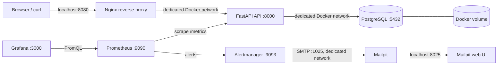

**English** | [Türkçe](README.tr.md)

# terraform-docker-infrastructure-lab

A production-style local infrastructure lab built with Terraform and Docker. It demonstrates infrastructure as code, modular Terraform design, application delivery, observability, alerting, load testing, and DevSecOps controls in a small but realistic environment.

> This project is intended for education and portfolio use. Production deployments require dedicated secret management, TLS, backups, hardened network policies, and production-grade observability and security.

## What this demonstrates

- Modular Terraform boundaries for the Docker network, application stack, and observability stack.
- State-safe Terraform refactoring with explicit `moved` blocks that preserve resource identities.
- Native `terraform test` plan tests using mocked Docker providers.
- CI validation and security scanning with TFLint, Trivy, Gitleaks, and Hadolint.
- A containerized FastAPI/PostgreSQL stack behind Nginx.
- Prometheus, Grafana, Alertmanager, and Mailpit observability for the local stack.
- End-to-end load and alert lifecycle tests covering controlled errors, latency, and API downtime.

The `production` profile is a local example with different names and ports; this repository does not provision or claim to be a production deployment.

## Architecture



Only Nginx is exposed as the public application entry point; FastAPI and PostgreSQL host ports are not published. Prometheus, Grafana, Alertmanager, and the Mailpit web UI are exposed on separate host ports for local observability. Mailpit SMTP is reachable only as mailpit:1025 on the dedicated Docker network. Services discover one another through Docker container names and aliases. PostgreSQL data is stored in a persistent Docker volume named from ${environment}.

## Technologies

- Terraform 1.5+ with the kreuzwerker/docker provider 3.x
- Docker Engine / Docker Desktop
- Nginx 1.27 Alpine
- Python 3.12, FastAPI, Uvicorn, and psycopg 3
- Prometheus client, Prometheus, and Grafana
- PostgreSQL 16 Alpine
- k6
- GitHub Actions

## Prerequisites

Docker Desktop or Docker Engine must be running. Terraform 1.5+ and Python 3.12+ are required. make test requires the Python test dependencies in the active virtual environment. Load and end-to-end alert tests also require curl, jq, and a running Terraform-managed stack; k6 runs from the pinned official grafana/k6 image.

## Quick start

```bash
cp terraform.tfvars.example terraform.tfvars
# Change the example password in terraform.tfvars for local use only.

make init
make fmt
make validate
make plan
make apply
```

After a successful apply:

```bash
curl http://localhost:8080/
curl http://localhost:8080/health
curl http://localhost:8080/db-health
curl http://localhost:8080/metrics
```

You can also use the application_url, prometheus_url, grafana_url, alertmanager_url, and mailpit_url Terraform outputs. Sign in to Grafana with username admin and the grafana_admin_password value from local terraform.tfvars.

The checked-in example variable file publishes Nginx on port 8080. The local terraform.tfvars used for the verified development run publishes it on port 8081; use the application_url output rather than assuming either port.

## Development and local production-style profile

The example files contain no real secrets. Create a local variable file:

```bash
cp environments/development.tfvars.example terraform.tfvars
make plan
make apply
```

To try the local profile named `production` (it is not a production deployment):

```bash
cp environments/production.tfvars.example terraform-production.tfvars
# Change the password in terraform-production.tfvars.
terraform plan -var-file=terraform-production.tfvars
terraform apply -var-file=terraform-production.tfvars
```

*.tfvars files are ignored by Git. Never commit a real password or secret. CI runs formatting, initialization/validation, and Python checks; automatic terraform apply requiring Docker access is not performed.

### FastAPI image rebuild behavior

The docker_image.app resource sorts file paths in the app/ build context and hashes their contents with SHA-256. The combined value is passed to the Terraform Docker provider as triggers.source_hash. A change to main.py, Dockerfile, requirements.txt, or another application source file causes the next terraform plan to propose an image rebuild.

Python and test/lint caches (__pycache__, .pytest_cache, .ruff_cache, .pyc) are excluded from the hash and Docker build context through .dockerignore. Only meaningful application inputs therefore trigger a rebuild.

## Make targets

| Command | Description |
|---|---|
| make init | Downloads provider dependencies and initializes Terraform. |
| make fmt | Formats Terraform files. |
| make validate | Validates the Terraform configuration. |
| make plan | Shows a change plan using terraform.tfvars. |
| make apply | Creates or updates the local Docker infrastructure. |
| make destroy | Removes Terraform-managed containers, network, and volume. |
| make test | Runs FastAPI tests and Ruff. |
| make terraform-test | Runs native Terraform tests without creating Docker resources. |
| make load-smoke | Runs a short k6 smoke test for /, /health, and /db-health. |
| make load-test | Runs staged VU growth with p95 and error-rate thresholds. |
| make alert-test-error | Validates HighErrorRate with opt-in controlled HTTP 500 traffic. |
| make alert-test-latency | Validates HighP95Latency with opt-in controlled latency. |
| make alert-test-down | Validates FastAPIDown and restores the API through trap cleanup. |
| make alert-test | Runs the error, latency, and down alert tests in sequence. |

For another variable file: make plan TFVARS=environments/development.tfvars.

## Endpoint reference

| Endpoint | Purpose |
|---|---|
| GET / | Returns the application name, environment, and runtime status. |
| GET /health | Reports FastAPI process readiness. |
| GET /db-health | Performs a real SELECT 1 database connectivity check. |
| GET /metrics | Exposes request and latency metrics scraped by Prometheus. |

GET /_test/error and GET /_test/latency?delay_ms=750 are available only when enable_test_endpoints = true and exist for k6 alert testing. The delay is validated between 50 and 2000 ms. These endpoints are disabled by default and in the production examples; they return no secrets, debug details, or stack traces.

### k6 load and end-to-end alert tests

Smoke and normal load tests measure success rate and p95 latency. Alert tests intentionally generate controlled HTTP 500 responses, latency, or API unavailability, so they are not part of the default make check target.

Enable the endpoints only in a local test environment and apply the change:

```hcl
enable_test_endpoints = true
```

Example commands:

```bash
make load-smoke
K6_LOAD_PEAK_VUS=20 K6_LOAD_STEADY_SECONDS=60 make load-test
make alert-test-error
K6_DELAY_MS=900 make alert-test-latency
make alert-test-down
make alert-test
```

K6_BASE_URL, K6_VUS, K6_DURATION, K6_P95_LIMIT_MS, K6_LOAD_PEAK_VUS, K6_LOAD_RAMP_SECONDS, K6_LOAD_STEADY_SECONDS, K6_ERROR_VUS, K6_LATENCY_VUS, and K6_DELAY_MS control the target, VU count, duration, and thresholds. The default in-container target is the existing Nginx alias; host networking is not assumed. Use ENVIRONMENT, CONTAINER_NAME_PREFIX, and NETWORK_NAME to select the Terraform naming convention.

scripts/test-alerts.sh checks required tools, the Docker network, and service health. It verifies alerts through the Prometheus HTTP API as Pending → Firing, confirms delivery through the Alertmanager API, and searches for the corresponding message through the Mailpit API. Existing Prometheus for and Alertmanager grouping intervals are not changed; the script uses bounded polling. During the FastAPIDown test, the API is restarted through a trap and all services are checked again at the end.

Results are available from Prometheus /alerts, Alertmanager /api/v2/alerts, and Mailpit /api/v1/messages, or through ports 9090, 9093, and 8025. After traffic stops, Prometheus transitions the alert to resolved; Alertmanager and Mailpit send resolved notifications because send_resolved is enabled.

These long-running tests interact with real Docker infrastructure and are intentionally excluded from automatic push/PR CI. Without isolated ephemeral Terraform resources, a Docker daemon, and non-conflicting ports, a manual workflow could affect shared local infrastructure; use the local commands for controlled verification.

## Verified load and alert test results

On 10 August 2026, one verification run was performed in the local development environment on macOS 26.5.2, arm64, with Docker Engine 28.3.0 running under Docker Desktop. The host Terraform CLI reported 1.15.8; the real plan/apply and native tests ran in a Terraform 1.9.8 container for compatibility with the existing CI. These figures are not universal performance benchmarks; they are observations from this single local development run.

| Test | Result | Requests | Error rate | p95 | Peak VU / duration | Alert lifecycle | Notification |
|---|---|---:|---:|---:|---|---|---|
| Smoke | Passed | 6,948 | 0.00% | 5.62 ms | 1 / 15 s | N/A | N/A |
| Load | Passed | 107,525 | 0.00% | 6.85 ms | 10 / 60 s | N/A | N/A |
| HighErrorRate | Passed | 135,905 | 100.00% controlled 500 | 3.82 ms | 5 / 75 s | Pending → Firing → Resolved | Alertmanager + Mailpit verified |
| HighP95Latency | Passed | 495 | 0.00% | 762.71 ms | 5 / 75.1 s | Pending → Firing → Resolved | Alertmanager + Mailpit verified |
| FastAPIDown | Passed | 353,774 | 100.00% expected down traffic | 0.17 ms | 1 / 45 s | Pending → Firing → Resolved | Alertmanager + Mailpit verified |

The k6 thresholds passed for both smoke and load tests. HighErrorRate produced controlled HTTP 500 responses for every request. HighP95Latency used delay_ms=750 and produced a measured p95 above the 500 ms alert threshold. During FastAPIDown, only the API container was stopped temporarily; cleanup/trap restarted it and /health returned HTTP 200 again.

enable_test_endpoints=true was used only for the opening plan and alert tests. After the closing plan was applied, /_test/error and /_test/latency returned HTTP 404 again. The PostgreSQL container and terraform-docker-lab-development-postgres-data volume were preserved with the same name and mount point; the network, Prometheus, Grafana, Alertmanager, and Mailpit resources were not changed.

After the tests, the variable-free real Terraform plan returned No changes, and all containers were healthy. To repeat the verification, use make load-smoke, make load-test, make alert-test-error, make alert-test-latency, and make alert-test-down. Alert tests can take several minutes because they honor the existing Prometheus for intervals.

## Prometheus and Grafana

FastAPI records every request in these metrics:

- fastapi_http_requests_total: request count with method, path, and HTTP status labels
- fastapi_http_request_duration_seconds: request-duration histogram with method and path labels

Prometheus scrapes this endpoint every 15 seconds. Terraform automatically provisions the Grafana datasource and the FastAPI Overview dashboard from files during apply.

- Prometheus: http://localhost:9090
- Grafana: http://localhost:3000
- Alertmanager: http://localhost:9093
- Mailpit: http://localhost:8025
- Grafana username: admin
- Grafana password: the grafana_admin_password value in local terraform.tfvars

The dashboard includes request rate, p95 latency, and HTTP status distribution panels. Prometheus and Grafana run on the same dedicated network as the API; the Grafana datasource is configured as http://prometheus:9090.

## Local alert management

Prometheus loads these rules from /etc/prometheus/rules/fastapi-alerts.yml:

- FastAPIDown: up{job="fastapi"} == 0; it fires after 30 seconds in pending state.
- HighErrorRate: fires after one minute when the FastAPI 5xx rate over the last two minutes exceeds five percent of total requests. It does not fire when there is no request data.
- HighP95Latency: fires after one minute when the p95 calculated with histogram_quantile(0.95, sum by (le) (..._bucket)) exceeds 500 ms. It does not fire without histogram data.

Alertmanager waits 10 seconds to group alerts, uses a 30-second group interval, and repeats notifications every two minutes. The receiver sends to Mailpit at mailpit:1025 without TLS or authentication; the recipient is an example .local address and no external email is sent.

Prometheus, Alertmanager, and Grafana configuration paths and contents are tracked with deterministic SHA-256 hashes. When a hash changes, the related terraform_data and replace_triggered_by relationships recreate the relevant container; configuration files are mounted read-only. Applying Terraform is sufficient after a configuration change.

Only PostgreSQL uses a named persistent Docker volume. Prometheus TSDB data, Grafana's local data, and Alertmanager state are stored in their container filesystems and are therefore lost if those containers are replaced; Terraform reprovisions the tracked configuration and dashboards. This is an intentional local-lab limitation, not a backup or durability design.

### Manually triggering and observing an alert

Manual docker stop is intended only to demonstrate alerting and Terraform runtime drift:

```bash
docker stop terraform-docker-lab-development-api
```

Then:

1. Open http://localhost:9090/alerts or http://localhost:9093/alerts.
2. Observe FastAPIDown become Pending, then Firing after 30 seconds.
3. Open the alert email in the Mailpit web UI at http://localhost:8025.
4. Restore the API container through Terraform:

   ```bash
   terraform apply -var-file=terraform.tfvars
   ```

5. Observe the Prometheus target become UP again, followed by resolved notifications in Alertmanager and Mailpit.

Stopping a container manually is a runtime drift example independent of Terraform state. It is not the normal operating procedure; persistent changes should be managed through Terraform.

### Production considerations

In production, replace Mailpit with an access-controlled SMTP relay or email provider. Do not put SMTP usernames, passwords, or TLS settings in the repository or plain container environment variables; use a secret manager or CI secret mechanism. Tune recipient lists, group_wait, group_interval, repeat_interval, alert thresholds, and for durations using real traffic and noise measurements. The local Alertmanager and Mailpit UIs use HTTP with limited authentication; production requires TLS, access control, persistent storage, and high availability.

## Repository structure

```text
.
├── .github/workflows/ci.yml
├── .github/dependabot.yml
├── .gitleaks.toml
├── .tflint.hcl
├── app/
│   ├── Dockerfile
│   ├── main.py
│   ├── requirements.txt
│   ├── requirements-dev.txt
│   ├── test_main.py
│   └── test_monitoring_config.py
├── environments/
│   ├── development.tfvars.example
│   └── production.tfvars.example
├── nginx/nginx.conf
├── prometheus/prometheus.yml
├── prometheus/rules/fastapi-alerts.yml
├── alertmanager/alertmanager.yml
├── modules/
│   ├── network/
│   │   ├── main.tf
│   │   ├── variables.tf
│   │   ├── outputs.tf
│   │   └── versions.tf
│   ├── application/
│   │   ├── main.tf
│   │   ├── variables.tf
│   │   ├── outputs.tf
│   │   └── versions.tf
│   └── observability/
│       ├── main.tf
│       ├── variables.tf
│       ├── outputs.tf
│       └── versions.tf
├── grafana/
│   ├── dashboards/fastapi-overview.json
│   └── provisioning/
│       ├── dashboards/dashboard.yml
│       └── datasources/prometheus.yml
├── k6/
│   ├── down.js
│   ├── error.js
│   ├── latency.js
│   ├── load.js
│   ├── smoke.js
│   └── lib/http.js
├── scripts/test-alerts.sh
├── tests/
│   ├── application.tftest.hcl
│   ├── network.tftest.hcl
│   ├── observability.tftest.hcl
│   └── root.tftest.hcl
├── main.tf
├── moved.tf
├── providers.tf
├── variables.tf
├── outputs.tf
├── Makefile
└── terraform.tfvars.example
```

The root module contains provider configuration, root variables, child-module calls, and output passthroughs. Responsibilities are separated as follows:

- modules/network: shared Docker network and the host-port uniqueness precondition
- modules/application: PostgreSQL volumes/images/containers, the FastAPI image build, and Nginx
- modules/observability: Prometheus, Grafana, Alertmanager, Mailpit, and monitoring configuration hash replacement

The Docker provider is configured only in the root module. Child-module versions.tf files declare provider source/version contracts without creating additional provider blocks.

## State migration and plan expectations

During the refactor, existing resource addresses are moved to module addresses through explicit mappings in moved.tf. No terraform state mv command or manual state editing is used. Terraform preserves Docker identities in the existing state while moving, for example, docker_container.app to module.application.docker_container.app.

Safe migration:

```bash
cp terraform.tfstate terraform.tfstate.refactor-backup
terraform init
terraform plan
```

The expected plan contains only state-address moves to module.* addresses and ends with 0 to add, 0 to change, 0 to destroy. If a container, image, network, or PostgreSQL volume replacement appears, do not run terraform apply; inspect the plan difference first. terraform.tfstate.refactor-backup is ignored by the existing .gitignore rules.

This refactor does not change the network name, container names, host ports, image tags, or PostgreSQL volume name. Because configuration hashes remain the same, Prometheus, Grafana, and Alertmanager should not be recreated.

## Terraform state

The local backend is used by default and creates the state file in the working directory. State is required to track real Docker resources, but it may contain secrets; *.tfstate* is ignored by .gitignore and must not be committed. Teams should use an encrypted, access-controlled remote backend.

## Security notes

- PostgreSQL is not published on a host port.
- PostgreSQL and Grafana password variables are marked `sensitive = true`, which redacts normal CLI output but does not remove values from Terraform state or Docker environment configuration.
- Use disposable local-only values; real secrets must not be committed, and local state must be protected or removed after use.
- Nginx uses HTTP here. Real deployments require TLS and a secret manager.
- Container image tags are pinned as examples; apply security scanning and controlled upgrades when updating them.

## Security checks

The DevSecOps controls in this repository provide different signals for application code, Terraform, Dockerfile, dependencies, container images, and Git history. None replaces a penetration test or a production security review.

| Tool | Check |
|---|---|
| TFLint | Terraform naming, unused declarations, required versions/providers, and general quality rules in the root module and modules/** |
| Trivy config | Terraform and Dockerfile IaC misconfigurations |
| Trivy fs | Repository dependency and secret scanning; ignore-unfixed for vulnerability results |
| Trivy image | HIGH/CRITICAL vulnerabilities in the locally built FastAPI image in CI |
| Gitleaks | Secret exposure in Git history and the current working tree |
| Hadolint | Best-practice and security linting for app/Dockerfile |
| Dependabot | GitHub Actions, Terraform provider, Python/pip, and Docker base-image updates |

### Native Terraform tests

terraform test validates root output/name contracts and plan behavior in modules/network, modules/application, and modules/observability. Tests in tests/*.tftest.hcl use command = plan and Docker provider mocks; they create no real image, container, network, or volume and do not touch the existing terraform.tfstate.

```bash
make terraform-test
```

terraform validate checks configuration syntax, types, provider schemas, and static references. terraform test runs plans and assertions for mock-provider scenarios. A real terraform plan compares the real provider and existing state with desired infrastructure, so it may require the Docker daemon and real environment inputs.

### Local security checks

If a tool is missing, Makefile targets report the missing tool and its official installation link:

```bash
make tflint
make hadolint
make gitleaks
make trivy
make security
```

make trivy scans Terraform/Dockerfile configuration, repository vulnerabilities/secrets, and, when Docker is available, builds and scans the local terraform-docker-lab-api:security image. The image build always uses --pull --no-cache. Image enforcement uses --ignore-unfixed --severity HIGH,CRITICAL: HIGH/CRITICAL findings with an upstream fix fail CI; findings without an upstream fix remain documented temporary accepted risk and are tracked through base-image and Dependabot updates. No CVE allowlist or broad suppression is added. The image scan does not use Terraform state or running Docker containers.

### CI behavior and triaging findings

GitHub Actions security checks do not run terraform apply. TFLint, Hadolint, and Gitleaks run in separate jobs with contents: read. Trivy config, filesystem, and CI image scans run in one job; IaC and image results are uploaded to GitHub code scanning as SARIF. No security-events: write permission is granted outside the SARIF upload job. On fork pull requests, SARIF upload may be skipped because of token permissions, while scanning and HIGH/CRITICAL enforcement continue.

When a job fails, inspect the file, rule ID/CVE, and severity in the log. Fix the code or dependency first; do not add broad ignores, path exclusions, or severity downgrades. If a narrow, verified false positive exists, document the rationale in code review.

Values such as local-only-change-me in example .tfvars files are not credentials. Gitleaks default rules remain enabled; only explicitly example .tfvars.example paths are allowlisted. Real terraform.tfvars, state, and secret files are not excluded from scanning.

### Accepted local-lab risks

- This educational project uses pinned public image tags; review Dependabot update PRs and Trivy findings regularly.
- Mailpit and monitoring UIs are local HTTP services; production requires TLS, access control, and a secret manager.
- CI image scanning requires a Docker daemon and scans only an ephemeral FastAPI image, not a registry or production image.
- If the Trivy vulnerability database or misconfiguration bundle cannot be downloaded, that is a tool/data-source access failure rather than a security result; the CI job should fail.

## Troubleshooting

**Cannot connect to the Docker daemon**: Start Docker Desktop/Engine and check docker info.

**Port already in use**: Change nginx_port in terraform.tfvars to an unused host port.

**db-health fails**: Check PostgreSQL health and logs with docker ps and docker logs terraform-docker-lab-development-postgres. The database may need a few seconds to become ready on first startup.

**Nginx returns 502**: Check API logs with docker logs terraform-docker-lab-development-api and inspect the Docker network; wait a few seconds after terraform apply if necessary.

**Prometheus target is DOWN**: Check target state with curl http://localhost:9090/targets. Confirm that the API container has the api network alias and that curl "$(terraform output -raw application_url)/metrics" returns data.

**Grafana dashboard is missing**: Check Grafana provisioning errors in the logs. Use docker inspect terraform-docker-lab-development-grafana to verify that grafana/provisioning and grafana/dashboards are mounted.

**Alertmanager receives no alerts**: Check Prometheus Status > Configuration, Status > Rules, and http://localhost:9090/alerts. Confirm that the Alertmanager target is alertmanager:9093 and both containers share the same Docker network.

**No email appears in Mailpit**: Check Alertmanager logs with docker logs terraform-docker-lab-development-alertmanager and Mailpit health. SMTP is not published to the host, so test the Alertmanager-to-Mailpit path through mailpit:1025, not localhost:1025.

**Provider or Terraform version error**: Confirm Terraform is in the >= 1.5.0, < 2.0.0 range and run make init again.

## Cleanup

```bash
make destroy
```

This removes Terraform-managed containers, network, and PostgreSQL volume; PostgreSQL data is deleted with the volume. Use Terraform for state-consistent cleanup instead of removing only containers manually.

## Concepts demonstrated

- Managing Docker image, container, network, and volume resources with the Docker provider
- Terraform variable types, descriptions, validation, and sensitive values
- Resource dependency graphs and service startup ordering
- Container health checks for process and database readiness
- Service discovery and reverse proxying over a Docker network
- Prometheus exposition format, scrape configuration, and Grafana file provisioning
- Request counter/histogram metrics and PromQL dashboard queries
- Prometheus alert rules, Alertmanager routing/grouping, and local SMTP testing with Mailpit
- Local Terraform state, plan/apply/destroy lifecycle, and outputs
- Pinned Python dependencies, Dockerfile practices, and basic API tests
- Docker-free Terraform CI validation and secure GitHub Actions design
