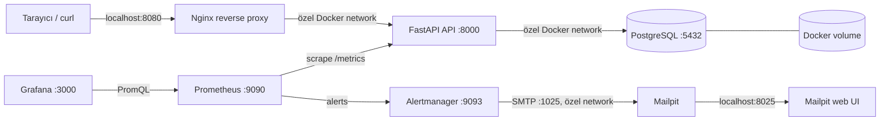

# terraform-docker-infrastructure-lab

Terraform ve Docker kullanarak yerel ortamda çalışan, üç katmanlı bir uygulama altyapısı eğitim projesi. Amaç; Terraform’un provider, resource, variable, output, dependency, state ve yeniden kullanılabilir yapılandırma yaklaşımını küçük ama gerçekçi bir örnek üzerinde göstermektir.

> Bu proje eğitim ve portföy amaçlıdır. Production ortamı için secret yönetimi, TLS, yedekleme, izleme ve daha güçlü ağ politikaları ayrıca tasarlanmalıdır.

## Mimari



Dışarıdan uygulamaya yalnızca Nginx üzerinden erişilir; FastAPI ve PostgreSQL host portlarına publish edilmez. Prometheus, Grafana, Alertmanager ve Mailpit web arayüzü eğitim gözlemlenebilirliği için ayrı host portlarından açılır. Mailpit’in SMTP portu host’a publish edilmez; yalnızca özel Docker network içinde `mailpit:1025` olarak kullanılır. Servisler özel Docker network üzerinde container adıyla haberleşir. PostgreSQL verisi `${environment}` bazlı kalıcı Docker volume içinde tutulur.

## Kullanılan teknolojiler

- Terraform 1.5+ ve `kreuzwerker/docker` provider 3.x
- Docker Engine / Docker Desktop
- Nginx 1.27 Alpine
- Python 3.12, FastAPI, Uvicorn ve psycopg 3
- Prometheus client, Prometheus ve Grafana
- PostgreSQL 16 Alpine
- GitHub Actions

## Ön koşullar

Docker Desktop veya Docker Engine çalışıyor olmalı. Ayrıca Terraform 1.5+ ve Python 3.12+ kurulu olmalıdır. `make test` için Python sanal ortamında test bağımlılıkları bulunmalıdır.

## Hızlı başlangıç

```bash
cp terraform.tfvars.example terraform.tfvars
# terraform.tfvars içindeki örnek parolayı yalnızca lokal kullanım için değiştirin.

make init
make fmt
make validate
make plan
make apply
```

Başarılı apply sonrasında:

```bash
curl http://localhost:8080/
curl http://localhost:8080/health
curl http://localhost:8080/db-health
curl http://localhost:8080/metrics
```

Terraform çıktısındaki `application_url`, `prometheus_url`, `grafana_url`, `alertmanager_url` ve `mailpit_url` değerlerini de kullanabilirsiniz. Grafana’ya `admin` kullanıcı adı ve kendi `grafana_admin_password` değerinizle giriş yapın.

## Development ve production örnekleri

Örnek dosyalar gerçek secret içermez; kendi lokal dosyanızı oluşturun:

```bash
cp environments/development.tfvars.example terraform.tfvars
make plan
make apply
```

Production isimlendirmesini ve portunu lokal olarak denemek için:

```bash
cp environments/production.tfvars.example terraform-production.tfvars
# terraform-production.tfvars içindeki parolayı değiştirin.
terraform plan -var-file=terraform-production.tfvars
terraform apply -var-file=terraform-production.tfvars
```

`*.tfvars` dosyaları `.gitignore` içindedir. Gerçek parola veya secret commit edilmemelidir. CI yalnızca format/init/validation ve Python kontrollerini çalıştırır; Docker erişimi gerektiren `terraform apply` otomatik çalıştırılmaz.

### FastAPI image rebuild davranışı

`docker_image.app` kaynağı, `app/` build context’indeki dosya yollarını sıralayıp her dosyanın içeriğiyle birlikte SHA-256 hash’ler. Bu birleşik değer Terraform Docker provider’ın `triggers.source_hash` alanına verilir. `main.py`, `Dockerfile`, `requirements.txt` veya `app/` altındaki başka bir kaynak değiştiğinde sonraki `terraform plan` image’ın yeniden oluşturulmasını gösterir.

Python cache ve test/lint cache dosyaları (`__pycache__`, `.pytest_cache`, `.ruff_cache`, `.pyc`) hash’e dahil edilmez; bunlar Docker build context’inden de `.dockerignore` ile çıkarılır. Böylece yalnızca gerçek uygulama girdilerindeki değişiklikler rebuild tetikler.

## Make komutları

| Komut | Açıklama |
|---|---|
| `make init` | Provider bağımlılıklarını indirir ve Terraform’u başlatır. |
| `make fmt` | Terraform dosyalarını formatlar. |
| `make validate` | Terraform yapılandırmasını doğrular. |
| `make plan` | `terraform.tfvars` ile değişiklik planını gösterir. |
| `make apply` | Lokal Docker altyapısını oluşturur veya günceller. |
| `make destroy` | Container, network ve volume kaynaklarını kaldırır. |
| `make test` | FastAPI testlerini ve Ruff lint kontrolünü çalıştırır. |

Başka bir değişken dosyası için: `make plan TFVARS=environments/development.tfvars`.

## Endpoint örnekleri

| Endpoint | Amaç |
|---|---|
| `GET /` | Uygulama adı, ortam ve çalışma bilgisini döndürür. |
| `GET /health` | FastAPI prosesinin hazır olduğunu gösterir. |
| `GET /db-health` | PostgreSQL’e gerçek bir `SELECT 1` bağlantı kontrolü yapar. |
| `GET /metrics` | Prometheus’un scrape ettiği istek sayısı ve gecikme metriklerini döndürür. |

## Prometheus ve Grafana

FastAPI, her isteği aşağıdaki iki metrikle ölçer:

- `fastapi_http_requests_total`: method, path ve HTTP status etiketleriyle toplam istek sayısı
- `fastapi_http_request_duration_seconds`: method ve path etiketleriyle istek süresi histogramı

Prometheus bu endpoint’i 15 saniyede bir scrape eder. Grafana datasource’u ve `FastAPI Overview` dashboard’u Terraform apply sırasında dosya provisioning ile otomatik yüklenir.

- Prometheus: `http://localhost:9090`
- Grafana: `http://localhost:3000`
- Alertmanager: `http://localhost:9093`
- Mailpit: `http://localhost:8025`
- Grafana kullanıcı adı: `admin`
- Grafana parolası: lokal `terraform.tfvars` içindeki `grafana_admin_password`

Dashboard’da istek hızı, P95 gecikme ve HTTP status dağılımı panelleri bulunur. Prometheus ve Grafana container’ları API ile aynı özel network üzerindedir; Grafana datasource URL’si `http://prometheus:9090` olarak tanımlıdır.

## Lokal alarm yönetimi

Prometheus aşağıdaki kuralları `/etc/prometheus/rules/fastapi-alerts.yml` dosyasından yükler:

- `FastAPIDown`: `up{job="fastapi"} == 0`, 30 saniye pending kaldıktan sonra firing olur.
- `HighErrorRate`: Son 2 dakikadaki FastAPI 5xx oranı toplam isteklerin yüzde 5’ini aşarsa 1 dakika sonra firing olur. Toplam istek yoksa veya veri yoksa alarm üretmez.
- `HighP95Latency`: `histogram_quantile(0.95, sum by (le) (..._bucket))` ile hesaplanan P95 gecikme 500 ms’yi aşarsa 1 dakika sonra firing olur. Histogram verisi yoksa alarm üretmez.

Alertmanager, alarm gruplarını 10 saniye bekleyip toplar, 30 saniyede bir grup aralığı uygular ve 2 dakikada bir tekrar bildirir. Receiver gerçek bir SMTP servisine bağlanmaz; TLS ve kimlik doğrulama olmadan `mailpit:1025` adresine gönderir. Alıcı adresi örnek bir `.local` adresidir ve harici e-posta göndermez.

Prometheus, Alertmanager ve Grafana yapılandırmalarındaki dosya yolları ve içerikleri deterministik SHA-256 hash ile izlenir. Hash değiştiğinde `terraform_data` ve `replace_triggered_by` ilişkisi ilgili container’ı yeniden oluşturur; config dosyaları container’lara read-only bind mount edilir. Bu nedenle config değişikliğinden sonra `terraform apply` çalıştırmak yeterlidir.

### Alarmı manuel olarak tetikleme ve izleme

Manuel `docker stop` yalnızca alarm ve Terraform drift davranışını eğitim amacıyla gözlemlemek içindir:

```bash
docker stop terraform-docker-lab-development-api
```

Ardından şu akışı izleyin:

1. `http://localhost:9090/alerts` veya `http://localhost:9093/alerts` sayfasını açın.
2. `FastAPIDown` alarmının önce **Pending**, 30 saniye sonrasında **Firing** olduğunu gözlemleyin.
3. `http://localhost:8025` adresindeki Mailpit web arayüzünde alarm e-postasını açın.
4. API container’ını Terraform ile geri getirin:

   ```bash
   terraform apply -var-file=terraform.tfvars
   ```

5. Prometheus target’ının tekrar UP olmasını, Alertmanager’da resolved bildiriminin ve Mailpit’te resolved e-postasının oluşmasını gözlemleyin.

`docker stop` ile yapılan manuel değişiklik Terraform state’inden bağımsız bir runtime drift örneğidir. Bu işlem normal işletim yöntemi değildir; kalıcı değişiklikler Terraform ile yönetilmelidir.

### Production farkları

Production’da Mailpit yerine erişim kontrollü gerçek bir SMTP relay veya e-posta sağlayıcısı kullanılmalıdır. SMTP kullanıcı adı, parola ve TLS ayarları repository’ye veya düz container environment değişkenlerine yazılmamalı; secret manager/CI secret mekanizması kullanılmalıdır. Alıcı listeleri, `group_wait`, `group_interval`, `repeat_interval`, alarm eşikleri ve `for` süreleri gürültü ile gecikme dengesi için gerçek trafik üzerinden ayarlanmalıdır. Alertmanager ve Mailpit web arayüzleri bu lokal projede HTTP ve kimlik doğrulaması sınırlı şekilde çalışır; production’da TLS, erişim kontrolü, kalıcı depolama ve yüksek erişilebilirlik ayrıca tasarlanmalıdır.

## Proje dizin yapısı

```text
.
├── .github/workflows/ci.yml
├── app/
│   ├── Dockerfile
│   ├── main.py
│   ├── requirements.txt
│   ├── requirements-dev.txt
│   ├── test_main.py
│   └── test_monitoring_config.py
├── environments/
│   ├── development.tfvars.example
│   └── production.tfvars.example
├── nginx/nginx.conf
├── prometheus/prometheus.yml
├── prometheus/rules/fastapi-alerts.yml
├── alertmanager/alertmanager.yml
├── grafana/
│   ├── dashboards/fastapi-overview.json
│   └── provisioning/
│       ├── dashboards/dashboard.yml
│       └── datasources/prometheus.yml
├── main.tf
├── providers.tf
├── variables.tf
├── outputs.tf
├── Makefile
└── terraform.tfvars.example
```

Bu örnekte kaynaklar tek bir kök modülde tutuldu. Üç servisin tanımları birbirinden farklı olduğu için yapay bir modül katmanı eklenmedi; daha büyük projelerde tekrar eden container veya network desenleri `modules/` altına taşınabilir.

## Terraform state

Local backend varsayılan olarak kullanılır ve state dosyası çalışma dizininde oluşur. State, oluşturulan Docker kaynaklarının gerçek durumunu takip etmek için gereklidir; ancak secret değerleri içerebileceğinden `*.tfstate*` `.gitignore` içindedir ve repository’ye gönderilmemelidir. Ekip çalışmasında şifreli, erişim kontrollü uzak backend tercih edilmelidir.

## Güvenlik notları

- PostgreSQL host portuna publish edilmez.
- PostgreSQL ve Grafana parola değişkenleri `sensitive = true` olarak tanımlıdır.
- Gerçek secret’lar `.tfvars` veya state içine yazılmamalı; eğitimde bile lokal, geçici değerler kullanılmalıdır.
- Nginx burada HTTP ile çalışır. Gerçek kullanımda TLS ve secret manager eklenmelidir.
- Container image tag’leri örnek olarak sabitlenmiştir; güncelleme yapılırken güvenlik taraması ve kontrollü yükseltme uygulanmalıdır.

## Sorun giderme

**`Cannot connect to the Docker daemon`**: Docker Desktop/Engine’i başlatın ve `docker info` komutunu kontrol edin.

**Port zaten kullanılıyor**: `terraform.tfvars` içindeki `nginx_port` değerini boş bir host portuyla değiştirin.

**`db-health` başarısız**: `docker ps` ve `docker logs terraform-docker-lab-development-postgres` ile PostgreSQL’in health durumunu ve loglarını kontrol edin. İlk başlatmada veritabanının hazır olması birkaç saniye sürebilir.

**Nginx 502 döndürüyor**: API container loglarını (`docker logs terraform-docker-lab-development-api`) ve `docker network inspect` çıktısını kontrol edin; gerekirse `terraform apply` sonrasında birkaç saniye bekleyin.

**Prometheus target’ı DOWN**: `curl http://localhost:9090/targets` ile target durumunu kontrol edin. API container’ının `api` network alias’ına sahip olduğundan ve `curl http://localhost:8080/metrics` çıktısının döndüğünden emin olun.

**Grafana dashboard’u görünmüyor**: Grafana loglarında provisioning hatası arayın. `grafana/provisioning` ve `grafana/dashboards` klasörlerinin container’a doğru mount edildiğini kontrol etmek için `docker inspect terraform-docker-lab-development-grafana` kullanın.

**Alertmanager alarm almıyor**: Prometheus’ta `Status > Configuration`, `Status > Rules` ve `http://localhost:9090/alerts` sayfalarını kontrol edin. Alertmanager target’ının `alertmanager:9093` olduğundan ve iki container’ın aynı Docker network’te bulunduğundan emin olun.

**Mailpit’te e-posta görünmüyor**: Alertmanager loglarını (`docker logs terraform-docker-lab-development-alertmanager`) ve Mailpit health durumunu kontrol edin. SMTP portu host’a açılmadığı için testleri `localhost:1025` yerine Alertmanager’ın özel network içindeki `mailpit:1025` bağlantısıyla yapın.

**Provider veya Terraform sürüm hatası**: Terraform sürümünün `>= 1.5.0, < 2.0.0` aralığında olduğundan emin olun ve `make init` komutunu yeniden çalıştırın.

## Temizleme

```bash
make destroy
```

Bu komut Terraform’un yönettiği container, network ve PostgreSQL volume’unu kaldırır; PostgreSQL verisi de volume ile birlikte silinir. Sadece container’ları kaldırmak yerine state ile uyumlu temizlik için Terraform kullanın.

## Bu projede öğrenilen kavramlar

- Docker provider ile image, container, network ve volume resource yönetimi
- Terraform variable tipleri, açıklamaları, validation ve sensitive değerler
- Resource dependency graph ve servis başlatma sırası
- Container healthcheck ile proses ve veritabanı hazır olma kontrolü
- Docker network üzerinden servis keşfi ve reverse proxy
- Prometheus exposition formatı, scrape config ve Grafana file provisioning
- Request counter/histogram metrikleri ve PromQL dashboard sorguları
- Prometheus alert rules, Alertmanager routing/grouping ve Mailpit ile lokal SMTP testleri
- Local Terraform state, plan/apply/destroy döngüsü ve outputs
- Sabitlenmiş Python bağımlılıkları, Dockerfile ve temel API testleri
- Docker gerektirmeyen Terraform CI doğrulaması ve güvenli GitHub Actions tasarımı
