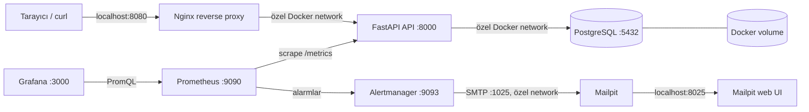

[English](README.md) | **Türkçe**

# terraform-docker-infrastructure-lab

Terraform ve Docker ile oluşturulmuş, production-style bir lokal altyapı laboratuvarıdır. Küçük fakat gerçekçi bir ortamda infrastructure as code, modüler Terraform tasarımı, uygulama teslimi, gözlemlenebilirlik, alarm yönetimi, yük testi ve DevSecOps kontrollerini gösterir.

> Bu proje eğitim ve portföy kullanımı içindir. Production dağıtımları özel secret yönetimi, TLS, yedekleme, güçlendirilmiş ağ politikaları ve production-grade gözlemlenebilirlik/güvenlik tasarımı gerektirir.

## Mimari



Uygulamanın dışarıya açık giriş noktası yalnızca Nginx’tir; FastAPI ve PostgreSQL host portlarına publish edilmez. Prometheus, Grafana, Alertmanager ve Mailpit web UI lokal gözlemlenebilirlik için ayrı host portlarından açılır. Mailpit SMTP yalnızca özel Docker network üzerinde mailpit:1025 olarak erişilebilir. Servisler Docker container adları ve alias’larıyla birbirini bulur. PostgreSQL verisi ${environment} değerinden üretilen kalıcı Docker volume’unda tutulur.

## Teknolojiler

- Terraform 1.5+ ve kreuzwerker/docker provider 3.x
- Docker Engine / Docker Desktop
- Nginx 1.27 Alpine
- Python 3.12, FastAPI, Uvicorn ve psycopg 3
- Prometheus client, Prometheus ve Grafana
- PostgreSQL 16 Alpine
- k6
- GitHub Actions

## Ön koşullar

Docker Desktop veya Docker Engine çalışıyor olmalıdır. Terraform 1.5+ ve Python 3.12+ gereklidir. make test aktif virtual environment içinde Python test bağımlılıklarının kurulu olmasını gerektirir. Yük ve uçtan uca alarm testleri ayrıca curl, jq ve çalışan Terraform-managed stack gerektirir; k6 global olarak kurulmaz, sabitlenmiş resmi grafana/k6 image’ı ile çalıştırılır.

## Hızlı başlangıç

```bash
cp terraform.tfvars.example terraform.tfvars
# terraform.tfvars içindeki örnek parolayı yalnızca lokal kullanım için değiştirin.

make init
make fmt
make validate
make plan
make apply
```

Apply başarıyla tamamlandıktan sonra:

```bash
curl http://localhost:8080/
curl http://localhost:8080/health
curl http://localhost:8080/db-health
curl http://localhost:8080/metrics
```

Terraform output’larındaki application_url, prometheus_url, grafana_url, alertmanager_url ve mailpit_url değerlerini de kullanabilirsiniz. Grafana’ya admin kullanıcı adı ve lokal terraform.tfvars içindeki grafana_admin_password değeriyle giriş yapın.

Repository’deki örnek variable dosyası Nginx’i 8080 portundan publish eder. Doğrulanmış development çalışmasında kullanılan lokal terraform.tfvars ise 8081 portunu publish eder; iki porttan birini varsaymak yerine application_url output’unu kullanın.

## Development ve production örnekleri

Örnek dosyalar gerçek secret içermez. Lokal bir variable dosyası oluşturun:

```bash
cp environments/development.tfvars.example terraform.tfvars
make plan
make apply
```

Production adlandırmasını ve port profilini lokal olarak denemek için:

```bash
cp environments/production.tfvars.example terraform-production.tfvars
# terraform-production.tfvars içindeki parolayı değiştirin.
terraform plan -var-file=terraform-production.tfvars
terraform apply -var-file=terraform-production.tfvars
```

*.tfvars dosyaları Git tarafından ignore edilir. Gerçek parola veya secret commit edilmemelidir. CI format, init/validation ve Python kontrollerini çalıştırır; Docker erişimi gerektiren otomatik terraform apply çalıştırılmaz.

### FastAPI image rebuild davranışı

docker_image.app kaynağı app/ build context’indeki dosya yollarını sıralar ve içeriklerini SHA-256 ile hash’ler. Birleşik değer Terraform Docker provider’a triggers.source_hash olarak verilir. main.py, Dockerfile, requirements.txt veya başka bir uygulama kaynak dosyası değişirse sonraki terraform plan bir image rebuild önerir.

Python ve test/lint cache’leri (__pycache__, .pytest_cache, .ruff_cache, .pyc) hash’ten ve .dockerignore aracılığıyla Docker build context’inden çıkarılır. Böylece yalnızca anlamlı uygulama girdileri rebuild tetikler.

## Make hedefleri

| Komut | Açıklama |
|---|---|
| make init | Provider bağımlılıklarını indirir ve Terraform’u başlatır. |
| make fmt | Terraform dosyalarını formatlar. |
| make validate | Terraform yapılandırmasını doğrular. |
| make plan | terraform.tfvars kullanarak değişiklik planını gösterir. |
| make apply | Lokal Docker altyapısını oluşturur veya günceller. |
| make destroy | Terraform tarafından yönetilen container, network ve volume’u kaldırır. |
| make test | FastAPI testlerini ve Ruff’ı çalıştırır. |
| make terraform-test | Docker kaynağı oluşturmadan native Terraform testlerini çalıştırır. |
| make load-smoke | /, /health ve /db-health için kısa k6 smoke testi çalıştırır. |
| make load-test | Kademeli VU artışı ve p95/hata oranı eşikleriyle yük testi çalıştırır. |
| make alert-test-error | Opt-in kontrollü HTTP 500 trafiğiyle HighErrorRate’i doğrular. |
| make alert-test-latency | Opt-in kontrollü gecikmeyle HighP95Latency’yi doğrular. |
| make alert-test-down | FastAPIDown’ı doğrular ve trap cleanup ile API’yi geri getirir. |
| make alert-test | Error, latency ve down alarm testlerini sırayla çalıştırır. |

Başka bir variable dosyası için: make plan TFVARS=environments/development.tfvars.

## Endpoint referansı

| Endpoint | Amaç |
|---|---|
| GET / | Uygulama adını, ortamı ve çalışma durumunu döndürür. |
| GET /health | FastAPI prosesinin hazır olduğunu bildirir. |
| GET /db-health | Gerçek bir SELECT 1 veritabanı bağlantı kontrolü yapar. |
| GET /metrics | Prometheus tarafından scrape edilen istek ve gecikme metriklerini sunar. |

GET /_test/error ve GET /_test/latency?delay_ms=750 yalnızca enable_test_endpoints = true iken kullanılabilir ve k6 alarm testleri içindir. Gecikme 50–2000 ms arasında doğrulanır. Bu endpoint’ler varsayılan olarak ve production örneklerinde kapalıdır; secret, debug bilgisi veya stack trace döndürmez.

### k6 yük ve uçtan uca alarm testleri

Smoke ve normal load testleri başarı oranını ve p95 gecikmesini ölçer. Alarm testleri bilerek kontrollü HTTP 500, gecikme veya API erişilemezliği üretir; bu nedenle varsayılan make check hedefine dahil değildir.

Endpoint’leri yalnızca lokal test ortamında açıp apply edin:

```hcl
enable_test_endpoints = true
```

Örnek komutlar:

```bash
make load-smoke
K6_LOAD_PEAK_VUS=20 K6_LOAD_STEADY_SECONDS=60 make load-test
make alert-test-error
K6_DELAY_MS=900 make alert-test-latency
make alert-test-down
make alert-test
```

K6_BASE_URL, K6_VUS, K6_DURATION, K6_P95_LIMIT_MS, K6_LOAD_PEAK_VUS, K6_LOAD_RAMP_SECONDS, K6_LOAD_STEADY_SECONDS, K6_ERROR_VUS, K6_LATENCY_VUS ve K6_DELAY_MS hedefi, VU sayısını, süreyi ve eşikleri kontrol eder. Container içindeki varsayılan hedef mevcut Nginx alias’ıdır; host networking varsayılmaz. Terraform adlandırma düzenini seçmek için ENVIRONMENT, CONTAINER_NAME_PREFIX ve NETWORK_NAME kullanılabilir.

scripts/test-alerts.sh gerekli araçları, Docker network’ünü ve servis health durumlarını kontrol eder. Prometheus HTTP API üzerinden alarmı Pending → Firing olarak doğrular, Alertmanager API üzerinden teslimi kontrol eder ve karşılık gelen mesajı Mailpit API’de arar. Mevcut Prometheus for ve Alertmanager grouping aralıkları değiştirilmez; script süre sınırı olan polling kullanır. FastAPIDown testinde API trap ile yeniden başlatılır ve sonunda tüm servisler tekrar kontrol edilir.

Sonuçlar Prometheus /alerts, Alertmanager /api/v2/alerts ve Mailpit /api/v1/messages endpoint’lerinden veya sırasıyla 9090, 9093 ve 8025 portlarından görülebilir. Trafik durduktan sonra Prometheus alarmı resolved durumuna geçirir; send_resolved açık olduğu için Alertmanager ve Mailpit resolved bildirimi gönderir.

Bu uzun testler gerçek Docker altyapısıyla çalıştığı için otomatik push/PR CI’dan bilerek çıkarılmıştır. İzole ephemeral Terraform kaynakları, Docker daemon ve çakışmayan portlar olmadan manuel bir workflow paylaşılan lokal altyapıyı etkileyebilir; kontrollü doğrulama için lokal komutları kullanın.

## Doğrulanmış yük ve alarm testi sonuçları

10 Ağustos 2026 tarihinde macOS 26.5.2, arm64 ve Docker Desktop üzerindeki Docker Engine 28.3.0 ile lokal development ortamında tek bir doğrulama çalışması yapıldı. Host Terraform CLI 1.15.8 bildirdi; gerçek plan/apply ve native testler mevcut CI uyumluluğu için Terraform 1.9.8 container’ında çalıştırıldı. Bu değerler evrensel performans benchmark’ı değildir; tek bir lokal development çalışmasında gözlenen sonuçlardır.

| Test | Sonuç | İstek | Hata oranı | p95 | Peak VU / süre | Alarm lifecycle | Bildirim |
|---|---|---:|---:|---:|---|---|---|
| Smoke | Passed | 6,948 | 0.00% | 5.62 ms | 1 / 15 s | N/A | N/A |
| Load | Passed | 107,525 | 0.00% | 6.85 ms | 10 / 60 s | N/A | N/A |
| HighErrorRate | Passed | 135,905 | 100.00% kontrollü 500 | 3.82 ms | 5 / 75 s | Pending → Firing → Resolved | Alertmanager + Mailpit doğrulandı |
| HighP95Latency | Passed | 495 | 0.00% | 762.71 ms | 5 / 75.1 s | Pending → Firing → Resolved | Alertmanager + Mailpit doğrulandı |
| FastAPIDown | Passed | 353,774 | 100.00% beklenen down trafiği | 0.17 ms | 1 / 45 s | Pending → Firing → Resolved | Alertmanager + Mailpit doğrulandı |

Smoke ve load testlerinde k6 threshold’ları geçti. HighErrorRate her istekte kontrollü HTTP 500 üretti. HighP95Latency delay_ms=750 ile çalıştı ve ölçülen p95 değeri 500 ms alarm eşiğini geçti. FastAPIDown sırasında yalnızca API container’ı geçici olarak durduruldu; cleanup/trap API’yi yeniden başlattı ve /health tekrar HTTP 200 döndürdü.

enable_test_endpoints=true yalnızca açma planı ve alarm testleri sırasında kullanıldı. Kapanış planı uygulandıktan sonra /_test/error ve /_test/latency yeniden HTTP 404 döndürdü. PostgreSQL container’ı ve terraform-docker-lab-development-postgres-data volume’u aynı isim ve mount noktasıyla korundu; network, Prometheus, Grafana, Alertmanager ve Mailpit kaynakları değiştirilmedi.

Testlerden sonra değişkensiz gerçek Terraform planı No changes döndürdü ve tüm container’lar healthy kaldı. Doğrulamayı tekrarlamak için make load-smoke, make load-test, make alert-test-error, make alert-test-latency ve make alert-test-down komutlarını kullanın. Alarm testleri mevcut Prometheus for aralıklarına uyduğu için birkaç dakika sürebilir.

## Prometheus ve Grafana

FastAPI her isteği şu metriklerle kaydeder:

- fastapi_http_requests_total: method, path ve HTTP status label’larıyla istek sayısı
- fastapi_http_request_duration_seconds: method ve path label’larıyla istek süresi histogramı

Prometheus bu endpoint’i 15 saniyede bir scrape eder. Terraform apply sırasında Grafana datasource’u ve FastAPI Overview dashboard’u dosyalardan otomatik provision edilir.

- Prometheus: http://localhost:9090
- Grafana: http://localhost:3000
- Alertmanager: http://localhost:9093
- Mailpit: http://localhost:8025
- Grafana kullanıcı adı: admin
- Grafana parolası: lokal terraform.tfvars içindeki grafana_admin_password değeri

Dashboard istek hızı, p95 gecikme ve HTTP status dağılımı panellerini içerir. Prometheus ve Grafana API ile aynı özel network üzerinde çalışır; Grafana datasource’u http://prometheus:9090 olarak yapılandırılmıştır.

## Lokal alarm yönetimi

Prometheus kuralları /etc/prometheus/rules/fastapi-alerts.yml dosyasından yükler:

- FastAPIDown: up{job="fastapi"} == 0; 30 saniye pending kaldıktan sonra firing olur.
- HighErrorRate: Son iki dakikadaki FastAPI 5xx oranı toplam isteklerin yüzde beşini aşarsa bir dakika sonra firing olur. İstek verisi yoksa alarm üretmez.
- HighP95Latency: histogram_quantile(0.95, sum by (le) (..._bucket)) ile hesaplanan p95 500 ms’yi aşarsa bir dakika sonra firing olur. Histogram verisi yoksa alarm üretmez.

Alertmanager alarmları gruplamak için 10 saniye bekler, 30 saniyelik group interval kullanır ve bildirimleri iki dakikada bir tekrarlar. Receiver TLS veya authentication olmadan mailpit:1025 adresine gönderir; alıcı örnek bir .local adresidir ve harici e-posta gönderilmez.

Prometheus, Alertmanager ve Grafana yapılandırma yolları ve içerikleri deterministik SHA-256 hash’lerle izlenir. Hash değiştiğinde ilgili terraform_data ve replace_triggered_by ilişkileri container’ı yeniden oluşturur; yapılandırma dosyaları read-only mount edilir. Bu nedenle yapılandırma değişikliğinden sonra Terraform apply yeterlidir.

### Alarmı manuel tetikleme ve izleme

Manuel docker stop yalnızca alarm ve Terraform runtime drift davranışını göstermek içindir:

```bash
docker stop terraform-docker-lab-development-api
```

Ardından:

1. http://localhost:9090/alerts veya http://localhost:9093/alerts adresini açın.
2. FastAPIDown’ın Pending, 30 saniye sonra Firing olduğunu gözlemleyin.
3. http://localhost:8025 adresindeki Mailpit web UI’da alarm e-postasını açın.
4. API container’ını Terraform ile geri getirin:

   ```bash
   terraform apply -var-file=terraform.tfvars
   ```

5. Prometheus target’ının yeniden UP olmasını, ardından Alertmanager ve Mailpit’te resolved bildirimlerini gözlemleyin.

Container’ı manuel durdurmak Terraform state’inden bağımsız bir runtime drift örneğidir. Normal işletim yöntemi değildir; kalıcı değişiklikler Terraform ile yönetilmelidir.

### Production değerlendirmeleri

Production’da Mailpit yerine erişim kontrollü bir SMTP relay veya e-posta sağlayıcısı kullanın. SMTP kullanıcı adı, parola ve TLS ayarlarını repository’ye veya düz container environment değişkenlerine yazmayın; secret manager veya CI secret mekanizması kullanın. Alıcı listelerini, group_wait, group_interval, repeat_interval, alarm eşiklerini ve for sürelerini gerçek trafik ve gürültü ölçümleriyle ayarlayın. Lokal Alertmanager ve Mailpit UI’ları sınırlı authentication ile HTTP kullanır; production TLS, erişim kontrolü, kalıcı depolama ve high availability gerektirir.

## Repository yapısı

```text
.
├── .github/workflows/ci.yml
├── .github/dependabot.yml
├── .gitleaks.toml
├── .tflint.hcl
├── app/
│   ├── Dockerfile
│   ├── main.py
│   ├── requirements.txt
│   ├── requirements-dev.txt
│   ├── test_main.py
│   └── test_monitoring_config.py
├── environments/
│   ├── development.tfvars.example
│   └── production.tfvars.example
├── nginx/nginx.conf
├── prometheus/prometheus.yml
├── prometheus/rules/fastapi-alerts.yml
├── alertmanager/alertmanager.yml
├── modules/
│   ├── network/
│   │   ├── main.tf
│   │   ├── variables.tf
│   │   ├── outputs.tf
│   │   └── versions.tf
│   ├── application/
│   │   ├── main.tf
│   │   ├── variables.tf
│   │   ├── outputs.tf
│   │   └── versions.tf
│   └── observability/
│       ├── main.tf
│       ├── variables.tf
│       ├── outputs.tf
│       └── versions.tf
├── grafana/
│   ├── dashboards/fastapi-overview.json
│   └── provisioning/
│       ├── dashboards/dashboard.yml
│       └── datasources/prometheus.yml
├── k6/
│   ├── down.js
│   ├── error.js
│   ├── latency.js
│   ├── load.js
│   ├── smoke.js
│   └── lib/http.js
├── scripts/test-alerts.sh
├── tests/
│   ├── application.tftest.hcl
│   ├── network.tftest.hcl
│   ├── observability.tftest.hcl
│   └── root.tftest.hcl
├── main.tf
├── moved.tf
├── providers.tf
├── variables.tf
├── outputs.tf
├── Makefile
└── terraform.tfvars.example
```

Root module provider yapılandırmasını, root variable’larını, child module çağrılarını ve output passthrough’larını içerir. Sorumluluklar şöyledir:

- modules/network: ortak Docker network ve host port benzersizliği precondition’ı
- modules/application: PostgreSQL volume/image/container’ları, FastAPI image build’i ve Nginx
- modules/observability: Prometheus, Grafana, Alertmanager, Mailpit ve monitoring configuration hash replacement

Docker provider yalnızca root module’da configure edilir. Child module’lardaki versions.tf dosyaları ek provider block oluşturmadan provider source/version sözleşmelerini bildirir.

## State migration ve plan beklentileri

Refactor sırasında mevcut resource adresleri moved.tf içindeki açık mapping’lerle module adreslerine taşınır. terraform state mv komutu veya state’in elle düzenlenmesi kullanılmaz. Terraform mevcut state’teki Docker kimliklerini korurken örneğin docker_container.app adresini module.application.docker_container.app adresine taşır.

Güvenli migration:

```bash
cp terraform.tfstate terraform.tfstate.refactor-backup
terraform init
terraform plan
```

Beklenen plan yalnızca state adreslerinin module.* adreslerine taşındığını göstermeli ve 0 to add, 0 to change, 0 to destroy ile bitmelidir. Container, image, network veya PostgreSQL volume replacement’ı görünürse terraform apply çalıştırmayın; önce plan farkını inceleyin. terraform.tfstate.refactor-backup mevcut .gitignore kuralları nedeniyle ignore edilir.

Bu refactor network adını, container adlarını, host portlarını, image tag’lerini veya PostgreSQL volume adını değiştirmez. Configuration hash’leri aynı kaldığı için Prometheus, Grafana ve Alertmanager yeniden oluşturulmamalıdır.

## Terraform state

Varsayılan olarak local backend kullanılır ve state dosyası çalışma dizininde oluşur. State gerçek Docker kaynaklarını izlemek için gereklidir, ancak secret içerebilir; *.tfstate* .gitignore tarafından ignore edilir ve commit edilmemelidir. Ekipler şifreli ve erişim kontrollü remote backend kullanmalıdır.

## Güvenlik notları

- PostgreSQL host portunda publish edilmez.
- PostgreSQL ve Grafana parola variable’ları sensitive = true olarak işaretlenmiştir.
- Gerçek secret’lar .tfvars veya state içine yazılmamalıdır; eğitimde bile lokal geçici değerler kullanılmalıdır.
- Nginx burada HTTP kullanır. Gerçek dağıtımlar TLS ve secret manager gerektirir.
- Container image tag’leri örnek olarak pinlenmiştir; güncellerken güvenlik taraması ve kontrollü yükseltme uygulayın.

## Security checks

Repository’deki DevSecOps kontrolleri application code, Terraform, Dockerfile, dependency, container image ve Git history için farklı sinyaller üretir. Bunların hiçbiri penetration testinin veya production security review’unun yerini tutmaz.

| Araç | Kontrol |
|---|---|
| TFLint | Root module ve modules/** altında Terraform naming, unused declaration, required version/provider ve genel kalite kuralları |
| Trivy config | Terraform ve Dockerfile IaC yanlış yapılandırmaları |
| Trivy fs | Repository dependency ve secret taraması; vulnerability sonuçları için ignore-unfixed |
| Trivy image | CI’da lokal oluşturulan FastAPI image’ındaki HIGH/CRITICAL açıklar |
| Gitleaks | Git history ve mevcut çalışma ağacındaki secret sızıntısı |
| Hadolint | app/Dockerfile best-practice ve security lint’i |
| Dependabot | GitHub Actions, Terraform provider, Python/pip ve Docker base image güncellemeleri |

### Native Terraform testleri

terraform test root output/name sözleşmelerini ve modules/network, modules/application, modules/observability plan davranışını doğrular. tests/*.tftest.hcl dosyaları command = plan ve Docker provider mock’ları kullanır; gerçek image, container, network veya volume oluşturmaz ve mevcut terraform.tfstate dosyasına dokunmaz.

```bash
make terraform-test
```

terraform validate yapılandırma syntax’ını, tipleri, provider schema’larını ve statik referansları kontrol eder. terraform test mock-provider senaryoları için plan ve assertion’ları çalıştırır. Gerçek terraform plan gerçek provider’ı ve mevcut state’i istenen altyapıyla karşılaştırır; bu nedenle Docker daemon ve gerçek ortam girdileri gerektirebilir.

### Lokal security checks

Bir araç kurulu değilse Makefile hedefleri eksik aracı ve resmi kurulum bağlantısını bildirir:

```bash
make tflint
make hadolint
make gitleaks
make trivy
make security
```

make trivy Terraform/Dockerfile configuration, repository vulnerability/secret taraması yapar ve Docker varsa lokal terraform-docker-lab-api:security image’ını build edip tarar. Image build her zaman --pull --no-cache kullanır. Image enforcement --ignore-unfixed --severity HIGH,CRITICAL kullanır: upstream fix’i olan HIGH/CRITICAL bulgular CI’ı başarısız yapar; fix’i olmayanlar geçici kabul edilmiş risk olarak belgelenir ve base image/Dependabot güncellemeleriyle takip edilir. Taramayı geçirmek için CVE allowlist veya geniş suppression eklenmez. Image taraması Terraform state’i veya çalışan Docker container’larını kullanmaz.

### CI davranışı ve bulgu inceleme

GitHub Actions security kontrolleri terraform apply çalıştırmaz. TFLint, Hadolint ve Gitleaks contents: read ile ayrı job’larda çalışır. Trivy config, filesystem ve CI image taramaları tek job’da çalışır; IaC ve image sonuçları SARIF olarak GitHub code scanning’e yüklenir. SARIF upload job’ı dışında security-events: write verilmez. Fork pull request’lerinde token izinleri nedeniyle SARIF upload atlanabilir; tarama ve HIGH/CRITICAL enforcement devam eder.

Bir job başarısız olduğunda logdaki dosya, rule ID/CVE ve severity bilgisini inceleyin. Önce kodu veya dependency’yi düzeltin; taramayı geçirmek için geniş ignore, path exclusion veya severity düşürme eklemeyin. Dar kapsamlı ve doğrulanmış bir false positive varsa gerekçeyi code review’da belgeleyin.

Örnek .tfvars dosyalarındaki local-only-change-me gibi değerler credential değildir. Gitleaks default kuralları açık kalır; yalnızca açıkça example olan .tfvars.example yolları allowlist’e alınır. Gerçek terraform.tfvars, state ve secret dosyaları taramadan çıkarılmaz.

### Kabul edilmiş lokal-lab riskleri

- Eğitim projesi pinlenmiş public image tag’leri kullanır; Dependabot update PR’larını ve Trivy bulgularını düzenli inceleyin.
- Mailpit ve monitoring UI’ları lokal HTTP servisleridir; production TLS, erişim kontrolü ve secret manager gerektirir.
- CI image taraması Docker daemon gerektirir ve yalnızca ephemeral FastAPI image’ını tarar; registry veya production image’ını taramaz.
- Trivy vulnerability database veya misconfiguration bundle indirilemezse bu güvenlik sonucu değil, araç/veri kaynağı erişim problemidir; CI job’ı başarısız olmalıdır.

## Sorun giderme

**Cannot connect to the Docker daemon**: Docker Desktop/Engine’i başlatın ve docker info komutunu kontrol edin.

**Port already in use**: terraform.tfvars içindeki nginx_port değerini kullanılmayan bir host portuyla değiştirin.

**db-health fails**: docker ps ve docker logs terraform-docker-lab-development-postgres ile PostgreSQL health durumunu ve loglarını kontrol edin. İlk başlatmada veritabanının hazır olması birkaç saniye sürebilir.

**Nginx returns 502**: docker logs terraform-docker-lab-development-api ile API loglarını, Docker network’ü ve terraform apply sonrasındaki başlangıç durumunu kontrol edin.

**Prometheus target is DOWN**: curl http://localhost:9090/targets ile target durumunu kontrol edin. API container’ının api network alias’ına sahip olduğunu ve curl "$(terraform output -raw application_url)/metrics" çıktısının geldiğini doğrulayın.

**Grafana dashboard is missing**: Grafana provisioning hatalarını loglarda arayın. grafana/provisioning ve grafana/dashboards mount’larını docker inspect terraform-docker-lab-development-grafana ile kontrol edin.

**Alertmanager receives no alerts**: Prometheus Status > Configuration, Status > Rules ve http://localhost:9090/alerts sayfalarını kontrol edin. Alertmanager target’ının alertmanager:9093 olduğunu ve iki container’ın aynı Docker network’te bulunduğunu doğrulayın.

**No email appears in Mailpit**: docker logs terraform-docker-lab-development-alertmanager ile Alertmanager loglarını ve Mailpit health durumunu kontrol edin. SMTP host’a publish edilmediği için Alertmanager–Mailpit yolunu localhost:1025 yerine mailpit:1025 üzerinden kontrol edin.

**Provider or Terraform version error**: Terraform’un >= 1.5.0, < 2.0.0 aralığında olduğunu doğrulayın ve make init komutunu tekrar çalıştırın.

## Temizleme

```bash
make destroy
```

Bu komut Terraform tarafından yönetilen container, network ve PostgreSQL volume’unu kaldırır; PostgreSQL verisi volume ile birlikte silinir. Yalnızca container’ları elle kaldırmak yerine state ile uyumlu temizlik için Terraform kullanın.

## Gösterilen kavramlar

- Docker provider ile image, container, network ve volume resource yönetimi
- Terraform variable tipleri, açıklamaları, validation ve sensitive değerler
- Resource dependency graph ve servis başlatma sırası
- Proses ve veritabanı hazır olma kontrolü için container healthcheck
- Docker network üzerinden service discovery ve reverse proxy
- Prometheus exposition formatı, scrape yapılandırması ve Grafana file provisioning
- Request counter/histogram metrikleri ve PromQL dashboard sorguları
- Prometheus alarm kuralları, Alertmanager routing/grouping ve Mailpit ile lokal SMTP testi
- Local Terraform state, plan/apply/destroy yaşam döngüsü ve outputs
- Pinlenmiş Python bağımlılıkları, Dockerfile uygulamaları ve temel API testleri
- Docker gerektirmeyen Terraform CI doğrulaması ve güvenli GitHub Actions tasarımı
